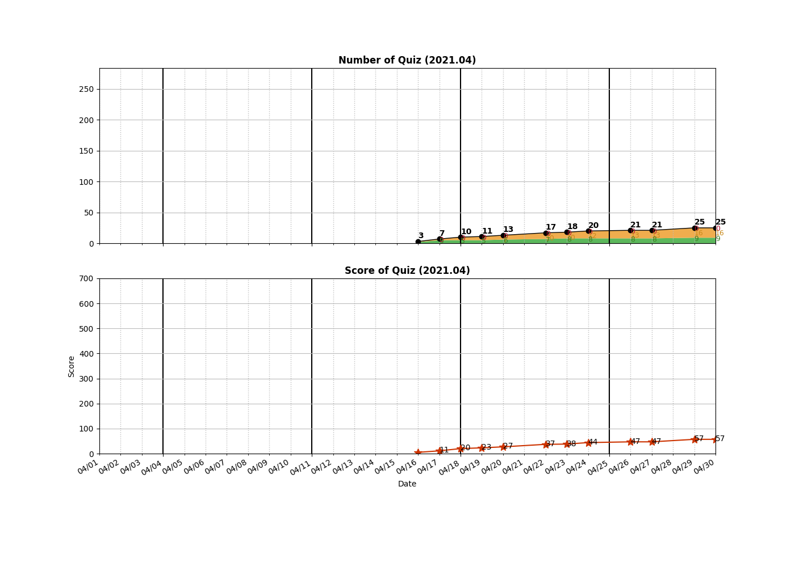
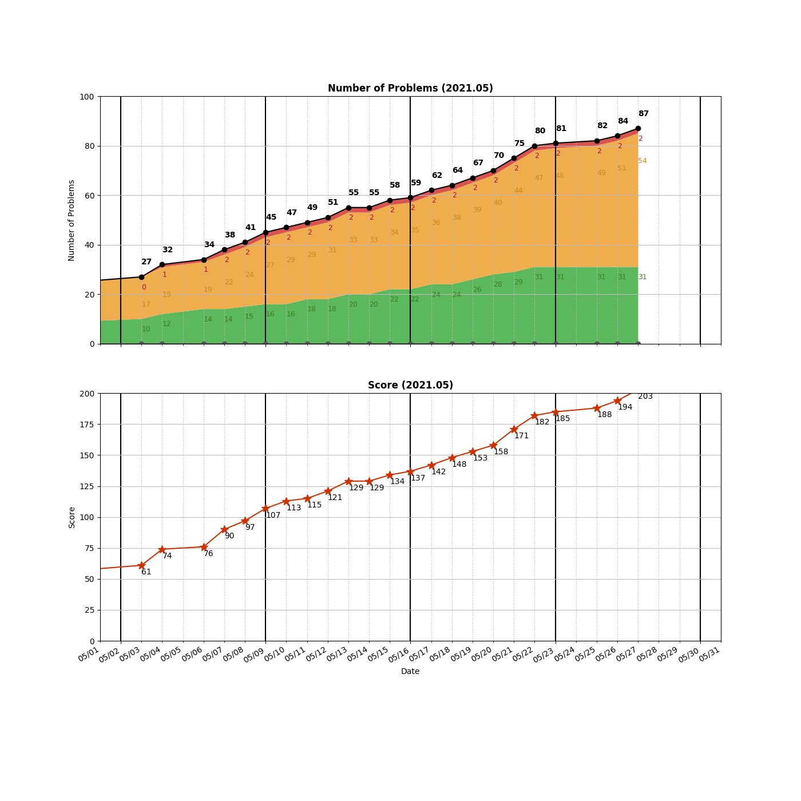
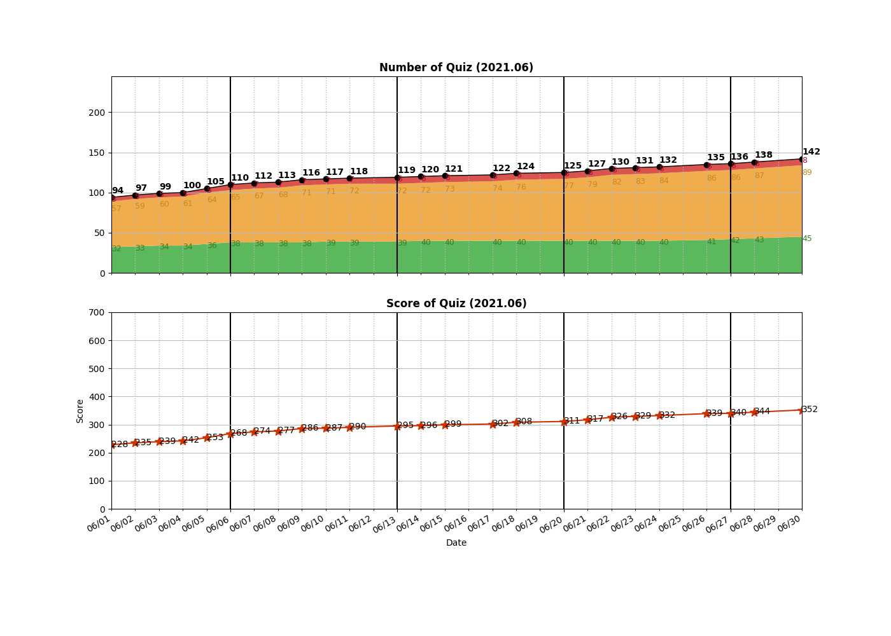
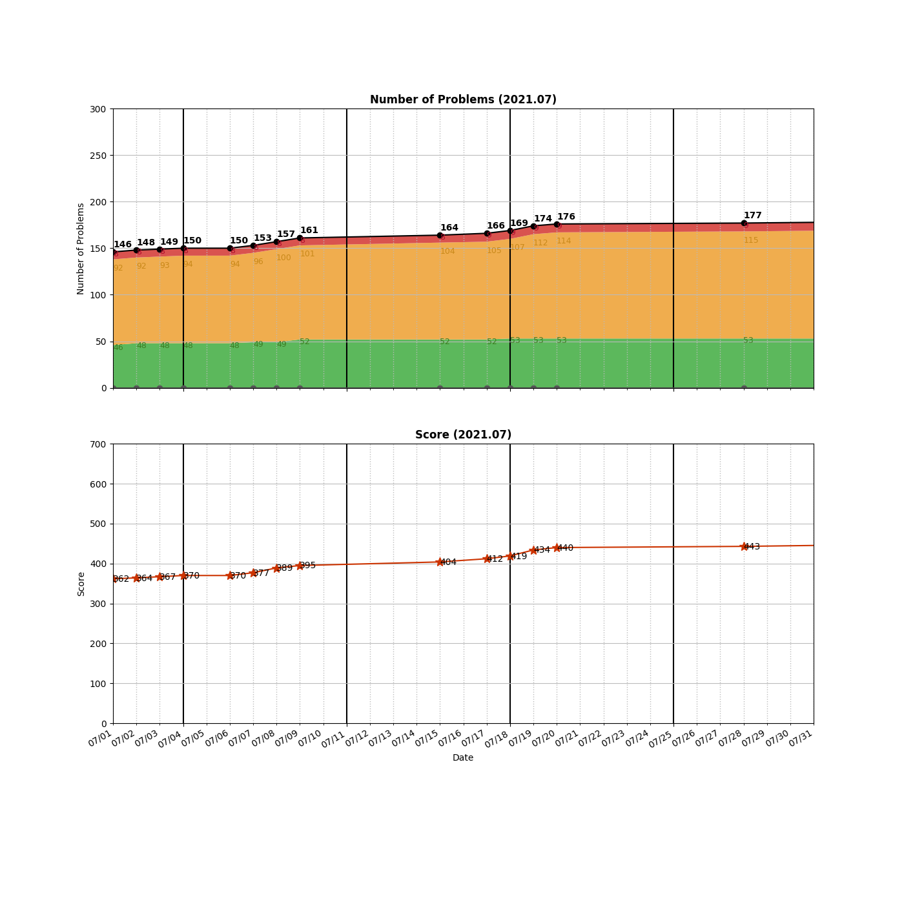
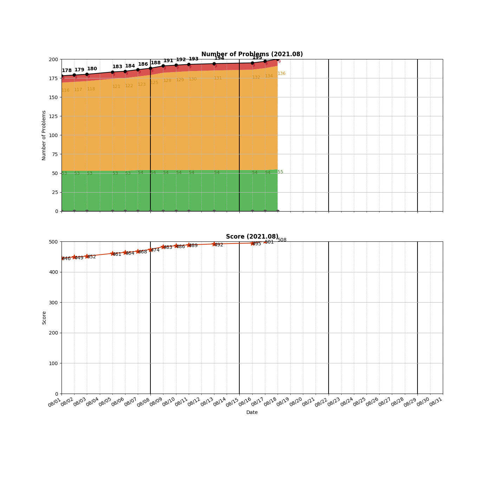
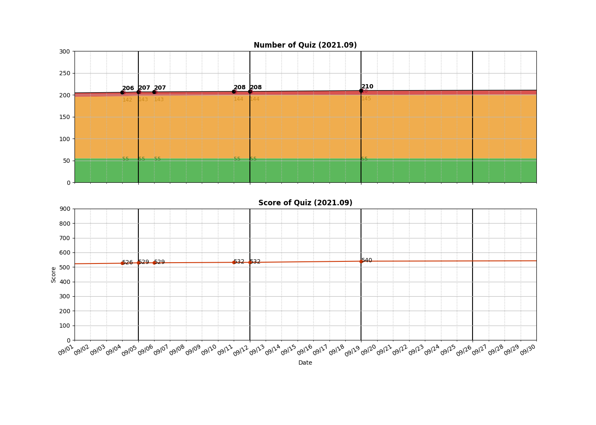
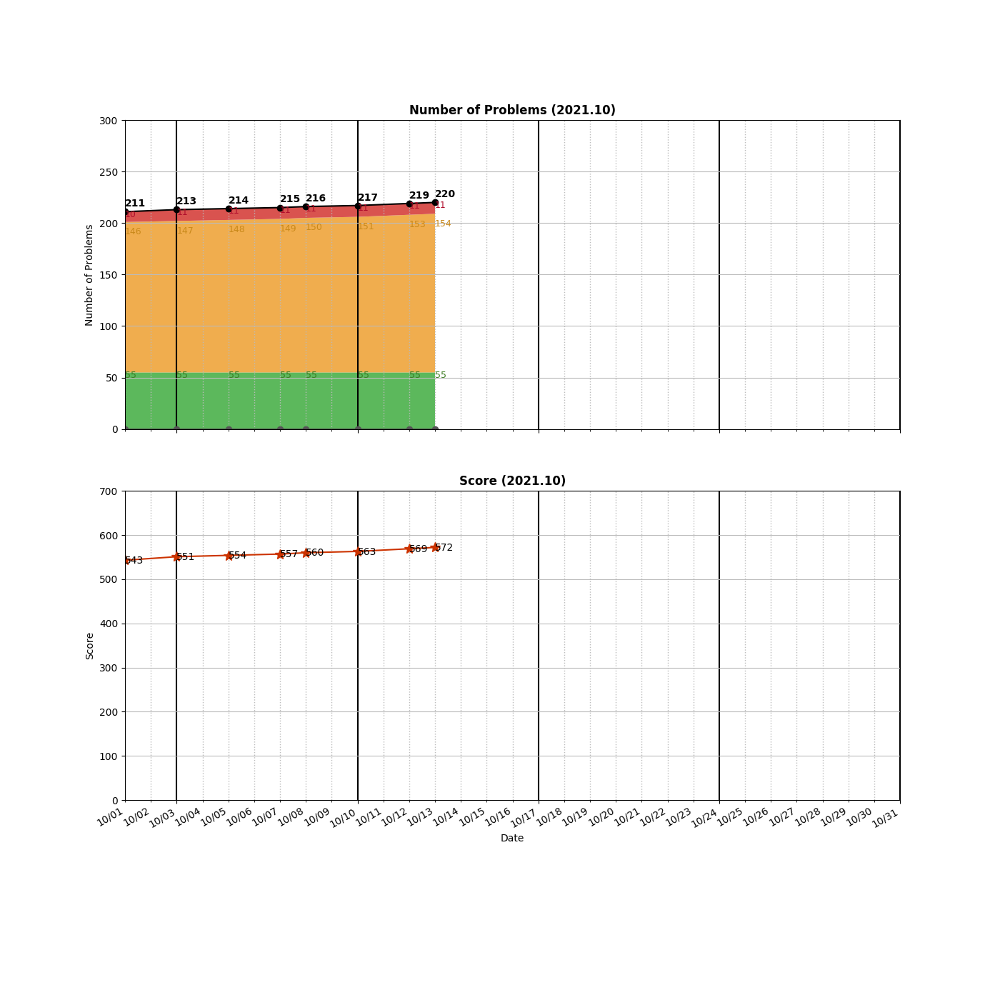
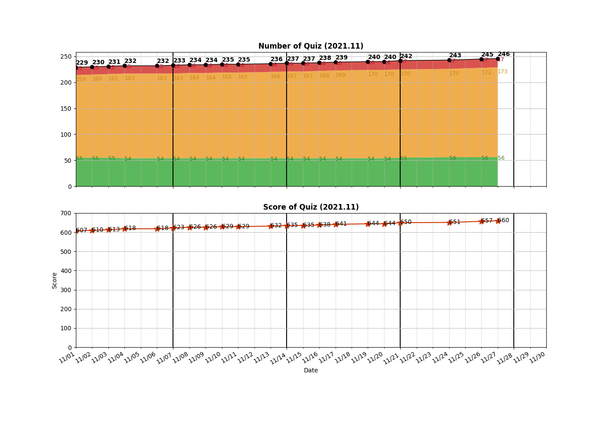
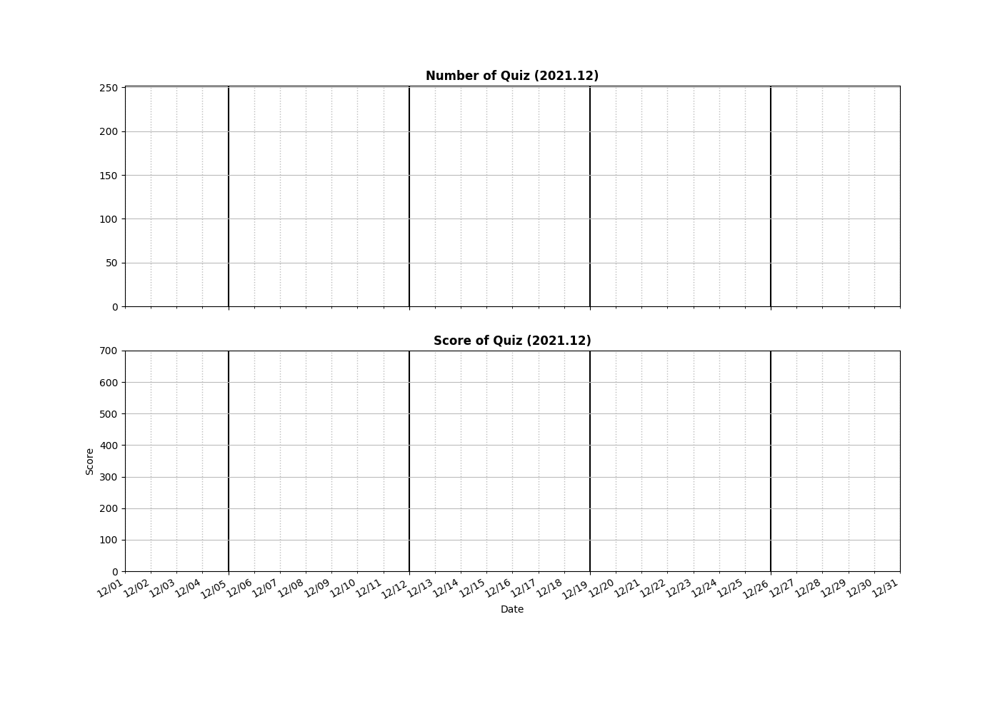
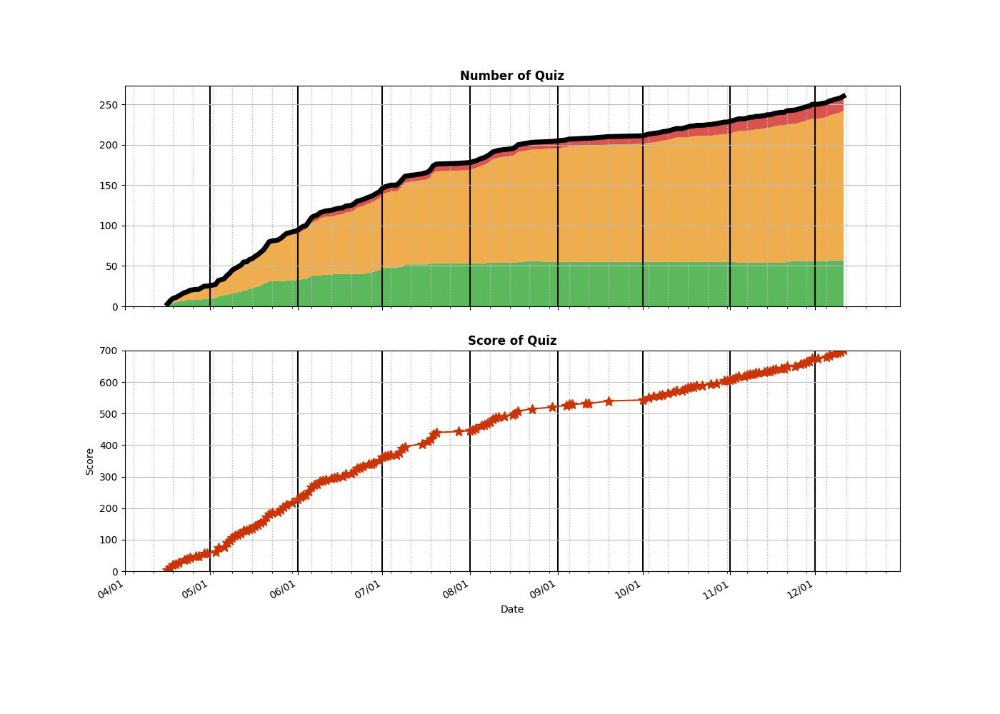

```
algo
├── Array
│   ├── __0036__Valid Sudoku.py
│   ├── __0053__Maximum Subarray.py
│   ├── __0056__Merge Intervals.py
│   ├── __0122__Best Time to Buy and Sell Stock II.py
│   ├── __0239__Sliding Window Maximum.py
│   ├── __0252__Meeting Rooms.py
│   ├── __0253__Meeting Rooms II.py
│   ├── __0283__Move Zeroes.py
│   ├── __0350__Intersection of Two Arrays II.py
│   └── __0670__Maximum Swap.py
├── BFS
│   ├── __0102__Binary Tree Level Order Traversal.py
│   ├── __0103__Binary Tree Zigzag Level Order Traversal.py
│   ├── __0107__Binary Tree Level Order Traversal II.py
│   ├── __0111__Minimum Depth of Binary Tree.py
│   ├── __0126__Word Ladder II.py
│   ├── __0127__Word Ladder.py
│   ├── __0133__Clone Graph.py
│   ├── __0199__Binary Tree Right Side View.py
│   ├── __0207__Course Schedule.py
│   ├── __0210__Course Schedule II.py
│   ├── __0286__Walls and Gates.py
│   ├── __0297__Serialize and Deserialize Binary Tree.py
│   ├── __0515__Find Largest Value in Each Tree Row.py
│   ├── __0662__Maximum Width of Binary Tree.py
│   ├── __0752__Open the Lock.py
│   ├── __0909__Snakes and Ladders.py
│   └── __0994__Rotting Oranges.py
├── BinarySearch
│   ├── __0004__Median of Two Sorted Arrays.py
│   ├── __0033__Search in Rotated Sorted Array.py
│   ├── __0034__Find First and Last Position of Element in Sorted Array.py
│   ├── __0050__Pow(x, n).py
│   ├── __0069__Sqrt(x).py
│   ├── __0074__Search a 2D Matrix.py
│   ├── __0153__Find Minimum in Rotated Sorted Array.py
│   ├── __0162__Find Peak Element.py
│   ├── __0240__Search a 2D Matrix II.py
│   ├── __0278__First Bad Version.py
│   ├── __0362__Design Hit Counter.py
│   ├── __0528__Random Pick with Weight.py
│   ├── __0540__Single Element in a Sorted Array.py
│   ├── __0658__Find K Closest Elements.py
│   ├── __0702__Search in a Sorted Array of Unknown Size.py
│   ├── __0704__Binary Search.py
│   ├── __0981__Time Based Key-Value Store.py
│   └── __1146__Snapshot Array.py
├── BitOperation
│   └── __0136__Single Number.py
├── DFS
│   ├── __0017__Letter Combinations of a Phone Number.py
│   ├── __0022__Generate Parentheses.py
│   ├── __0037__Sudoku Solver.py
│   ├── __0039__Combination Sum.py
│   ├── __0040__Combination Sum II.py
│   ├── __0046__Permutations.py
│   ├── __0047__Permutations II.py
│   ├── __0051__N-Queens.py
│   ├── __0052__N-Queens II.py
│   ├── __0077__Combinations.py
│   ├── __0078__Subsets.py
│   ├── __0079__Word Search.py
│   ├── __0089__Gray Code.py
│   ├── __0090__Subsets II.py
│   ├── __0112__Path Sum.py
│   ├── __0113__Path Sum II.py
│   ├── __0131__Palindrome Partitioning.py
│   ├── __0139__Word Break.py
│   ├── __0212__Word Search II.py
│   ├── __0216__Combination Sum III.py
│   ├── __0401__Binary Watch.py
│   ├── __0560__Subarray Sum Equals K.py
│   ├── __0690__Employee Importance.py
│   ├── __0784__Letter Case Permutation.py
│   ├── __0841__Keys and Rooms.py
│   ├── __1391__Check if There is a Valid Path in a Grid.py
│   └── __1593__Split a String Into the Max Number of Unique Substrings.py
├── DP
│   ├── __0010__Regular Expression Matching.py
│   ├── __0044__Wildcard Matching.py
│   ├── __0062__Unique Paths.py
│   ├── __0063__Unique Paths II.py
│   ├── __0064__Minimum Path Sum.py
│   ├── __0070__Climbing Stairs.py
│   ├── __0096__Unique Binary Search Trees.py
│   ├── __0118__Pascal's Triangle.py
│   ├── __0119__Pascal's Triangle II.py
│   ├── __0120__Triangle.py
│   ├── __0121__Best Time to Buy and Sell Stock.py
│   ├── __0221__Maximal Square.py
│   ├── __0279__Perfect Squares.py
│   ├── __0300__Longest Increasing Subsequence.py
│   ├── __0322__Coin Change.py
│   ├── __0377__Combination Sum IV.py
│   ├── __0416__Partition Equal Subset Sum.py
│   ├── __0474__Ones and Zeroes.py
│   ├── __0494__Target Sum.py
│   ├── __0518__Coin Change 2.py
│   ├── __0542__01 Matrix.py
│   ├── __0576__Out of Boundary Paths.py
│   ├── __0718__Maximum Length of Repeated Subarray.py
│   ├── __0935__Knight Dialer.py
│   ├── __1025__Divisor Game.py
│   ├── __1048__Longest String Chain.py
│   ├── __1049__Last Stone Weight II.py
│   ├── __1130__Minimum Cost Tree From Leaf Values.py
│   ├── __1137__N-th Tribonacci Number.py
│   ├── __1143__Longest Common Subsequence.py
│   ├── __1277__Count Square Submatrices with All Ones.py
│   ├── __1395__Count Number of Teams.py
│   ├── __1774__Closest Dessert Cost.py
│   └── __1937__Maximum Number of Points with Cost.py
├── DataStructure
│   ├── __0146__LRU Cache.py
│   ├── __0380__Insert Delete GetRandom O(1).py
│   ├── __0387__First Unique Character in a String.py
│   ├── __0706__Design HashMap.py
│   └── __1429__First Unique Number.py
├── Graph
│   ├── __0261__Graph Valid Tree.py
│   ├── __0323__Number of Connected Components in an Undirected Graph.py
│   ├── __0332__Reconstruct Itinerary.py
│   ├── __0399__Evaluate Division.py
│   ├── __0547__Number of Provinces.py
│   ├── __0684__Redundant Connection.py
│   ├── __0743__Network Delay Time.py
│   ├── __0787__Cheapest Flights Within K Stops.py
│   └── __0797__All Paths From Source to Target.py
├── HashMap
│   ├── __0001__Two Sum.py
│   ├── __0049__Group Anagrams.py
│   ├── __0287__Find the Duplicate Number.py
│   ├── __0290__Word Pattern.py
│   ├── __0347__Top K Frequent Elements.py
│   ├── __0535__Encode and Decode TinyURL.py
│   └── __0705__Design HashSet.py
├── Heap
│   ├── __0215__Kth Largest Element in an Array.py
│   ├── __0263__Ugly Number.py
│   ├── __0264__Ugly Number II.py
│   ├── __0378__Kth Smallest Element in a Sorted Matrix.py
│   ├── __0703__Kth Largest Element in a Stream.py
│   └── __0973__K Closest Points to Origin.py
├── Island
│   ├── __0130__Surrounded Regions.py
│   ├── __0200__Number of Islands.py
│   ├── __0305__Number of Islands II.py
│   ├── __0417__Pacific Atlantic Water Flow.py
│   ├── __0694__Number of Distinct Islands.py
│   ├── __0695__Max Area of Island.py
│   ├── __0934__Shortest Bridge.py
│   ├── __1020__Number of Enclaves.py
│   ├── __1254__Number of Closed Islands.py
│   └── __1905__Count Sub Islands.py
├── LinkedList
│   ├── __0002__Add Two Numbers.py
│   ├── __0019__Remove Nth Node From End of List.py
│   ├── __0021__Merge Two Sorted Lists.py
│   ├── __0023__Merge k Sorted Lists.py
│   ├── __0083__Remove Duplicates from Sorted List.py
│   ├── __0086__Partition List.py
│   ├── __0092__Reverse Linked List II.py
│   ├── __0138__Copy List with Random Pointer.py
│   ├── __0141__Linked List Cycle.py
│   ├── __0142__Linked List Cycle II.py
│   ├── __0148__Sort List.py
│   ├── __0160__Intersection of Two Linked Lists.py
│   ├── __0206__Reverse Linked List.py
│   ├── __0234__Palindrome Linked List.py
│   └── __0237__Delete Node in a Linked List.py
├── Math
│   └── __0593__Valid Square.py
├── Recursion
│   ├── __0095__Unique Binary Search Trees II.py
│   ├── __0241__Different Ways to Add Parentheses.py
│   ├── __0394__Decode String.py
│   ├── __0726__Number of Atoms.py
│   ├── __1087__Brace Expansion.py
│   └── __1096__Brace Expansion II.py
├── Sorting
│   └── __0242__Valid Anagram.py
├── Stack
│   ├── __0020__Valid Parentheses.py
│   ├── __0155__Min Stack.py
│   └── __0735__Asteroid Collision.py
├── String
│   ├── __0151__Reverse Words in a String.py
│   ├── __0423__Reconstruct Original Digits from English.py
│   ├── __0459__Repeated Substring Pattern.py
│   ├── __0767__Reorganize String.py
│   └── __0811__Subdomain Visit Count.py
├── Tree
│   ├── __0094__Binary Tree Inorder Traversal.py
│   ├── __0098__Validate Binary Search Tree.py
│   ├── __0099__Recover Binary Search Tree.py
│   ├── __0100__Same Tree.py
│   ├── __0101__Symmetric Tree.py
│   ├── __0104__Maximum Depth of Binary Tree.py
│   ├── __0108__Convert Sorted Array to Binary Search Tree.py
│   ├── __0109__Convert Sorted List to Binary Search Tree.py
│   ├── __0114__Flatten Binary Tree to Linked List.py
│   ├── __0116__Populating Next Right Pointers in Each Node.py
│   ├── __0129__Sum Root to Leaf Numbers.py
│   ├── __0144__Binary Tree Preorder Traversal.py
│   ├── __0173__Binary Search Tree Iterator.py
│   ├── __0226__Invert Binary Tree.py
│   ├── __0230__Kth Smallest Element in a BST.py
│   ├── __0235__Lowest Common Ancestor of a Binary Search Tree.py
│   ├── __0236__Lowest Common Ancestor of a Binary Tree.py
│   ├── __0257__Binary Tree Paths.py
│   ├── __0270__Closest Binary Search Tree Value.py
│   ├── __0314__Binary Tree Vertical Order Traversal.py
│   ├── __0341__Flatten Nested List Iterator.py
│   ├── __0366__Find Leaves of Binary Tree.py
│   ├── __0437__Path Sum III.py
│   ├── __0450__Delete Node in a BST.py
│   ├── __0510__Inorder Successor in BST II.py
│   ├── __0513__Find Bottom Left Tree Value.py
│   ├── __0538__Convert BST to Greater Tree.py
│   ├── __0543__Diameter of Binary Tree.py
│   ├── __0559__Maximum Depth of N-ary Tree.py
│   ├── __0572__Subtree of Another Tree.py
│   ├── __0617__Merge Two Binary Trees.py
│   ├── __0687__Longest Univalue Path.py
│   ├── __0863__All Nodes Distance K in Binary Tree.py
│   ├── __0958__Check Completeness of a Binary Tree.py
│   ├── __0979__Distribute Coins in Binary Tree.py
│   ├── __1038__Binary Search Tree to Greater Sum Tree.py
│   ├── __1110__Delete Nodes And Return Forest.py
│   ├── __1382__Balance a Binary Search Tree.py
│   └── __1448__Count Good Nodes in Binary Tree.py
├── Trie
│   ├── __0208__Implement Trie (Prefix Tree).py
│   ├── __0211__Design Add and Search Words Data Structure.py
│   └── __1268__Search Suggestions System.py
├── Two-Pointer
│   ├── __0003__Longest Substring Without Repeating Characters.py
│   ├── __0005__Longest Palindromic Substring.py
│   ├── __0011__Container With Most Water.py
│   ├── __0015__3Sum.py
│   ├── __0016__3Sum Closest.py
│   ├── __0018__4Sum.py
│   ├── __0031__Next Permutation.py
│   ├── __0042__Trapping Rain Water.py
│   ├── __0075__Sort Colors.py
│   ├── __0125__Valid Palindrome.py
│   ├── __0152__Maximum Product Subarray.py
│   ├── __0167__Two Sum II - Input array is sorted.py
│   ├── __0189__Rotate Array.py
│   ├── __0259__3Sum Smaller.py
│   ├── __0277__Find the Celebrity.py
│   ├── __0532__K-diff Pairs in an Array.py
│   ├── __0611__Valid Triangle Number.py
│   ├── __0680__Valid Palindrome II.py
│   ├── __0905__Sort Array By Parity.py
│   ├── __0912__Sort an Array.py
│   ├── __0922__Sort Array By Parity II.py
│   ├── __0969__Pancake Sorting.py
│   ├── __1099__Two Sum Less Than K.py
│   ├── __1214__Two Sum BSTs.py
│   └── __1711__Count Good Meals.py
├── UnionFind
│   ├── __0128__Longest Consecutive Sequence.py
│   └── __0721__Accounts Merge.py
└── _Experiment
    ├── 20210616_currency_rate.py
    ├── ArrayList.py
    ├── LinkedList.py
    ├── UnrolledLinkedList.py
    ├── UnrolledLinkedList_Benchmark.py
    └── __pycache__
        ├── ArrayList.cpython-37.pyc
        ├── LinkedList.cpython-37.pyc
        └── UnrolledLinkedList.cpython-37.pyc

23 directories, 252 files

=====================================
============= Local Repo ============
=====================================
__0001__Two Sum.py
__0002__Add Two Numbers.py
__0003__Longest Substring Without Repeating Characters.py
__0004__Median of Two Sorted Arrays.py
__0005__Longest Palindromic Substring.py
__0010__Regular Expression Matching.py
__0011__Container With Most Water.py
__0015__3Sum.py
__0016__3Sum Closest.py
__0017__Letter Combinations of a Phone Number.py
__0018__4Sum.py
__0019__Remove Nth Node From End of List.py
__0020__Valid Parentheses.py
__0021__Merge Two Sorted Lists.py
__0022__Generate Parentheses.py
__0023__Merge k Sorted Lists.py
__0031__Next Permutation.py
__0033__Search in Rotated Sorted Array.py
__0034__Find First and Last Position of Element in Sorted Array.py
__0036__Valid Sudoku.py
__0037__Sudoku Solver.py
__0039__Combination Sum.py
__0040__Combination Sum II.py
__0042__Trapping Rain Water.py
__0044__Wildcard Matching.py
__0046__Permutations.py
__0047__Permutations II.py
__0049__Group Anagrams.py
__0050__Pow(x, n).py
__0051__N-Queens.py
__0052__N-Queens II.py
__0053__Maximum Subarray.py
__0056__Merge Intervals.py
__0062__Unique Paths.py
__0063__Unique Paths II.py
__0064__Minimum Path Sum.py
__0069__Sqrt(x).py
__0070__Climbing Stairs.py
__0074__Search a 2D Matrix.py
__0075__Sort Colors.py
__0077__Combinations.py
__0078__Subsets.py
__0079__Word Search.py
__0083__Remove Duplicates from Sorted List.py
__0086__Partition List.py
__0089__Gray Code.py
__0090__Subsets II.py
__0092__Reverse Linked List II.py
__0094__Binary Tree Inorder Traversal.py
__0095__Unique Binary Search Trees II.py
__0096__Unique Binary Search Trees.py
__0098__Validate Binary Search Tree.py
__0099__Recover Binary Search Tree.py
__0100__Same Tree.py
__0101__Symmetric Tree.py
__0102__Binary Tree Level Order Traversal.py
__0103__Binary Tree Zigzag Level Order Traversal.py
__0104__Maximum Depth of Binary Tree.py
__0107__Binary Tree Level Order Traversal II.py
__0108__Convert Sorted Array to Binary Search Tree.py
__0109__Convert Sorted List to Binary Search Tree.py
__0111__Minimum Depth of Binary Tree.py
__0112__Path Sum.py
__0113__Path Sum II.py
__0114__Flatten Binary Tree to Linked List.py
__0116__Populating Next Right Pointers in Each Node.py
__0118__Pascal's Triangle.py
__0119__Pascal's Triangle II.py
__0120__Triangle.py
__0121__Best Time to Buy and Sell Stock.py
__0122__Best Time to Buy and Sell Stock II.py
__0125__Valid Palindrome.py
__0126__Word Ladder II.py
__0127__Word Ladder.py
__0128__Longest Consecutive Sequence.py
__0129__Sum Root to Leaf Numbers.py
__0130__Surrounded Regions.py
__0131__Palindrome Partitioning.py
__0133__Clone Graph.py
__0136__Single Number.py
__0138__Copy List with Random Pointer.py
__0139__Word Break.py
__0141__Linked List Cycle.py
__0142__Linked List Cycle II.py
__0144__Binary Tree Preorder Traversal.py
__0146__LRU Cache.py
__0148__Sort List.py
__0151__Reverse Words in a String.py
__0152__Maximum Product Subarray.py
__0153__Find Minimum in Rotated Sorted Array.py
__0155__Min Stack.py
__0160__Intersection of Two Linked Lists.py
__0162__Find Peak Element.py
__0167__Two Sum II - Input array is sorted.py
__0173__Binary Search Tree Iterator.py
__0189__Rotate Array.py
__0199__Binary Tree Right Side View.py
__0200__Number of Islands.py
__0206__Reverse Linked List.py
__0207__Course Schedule.py
__0208__Implement Trie (Prefix Tree).py
__0210__Course Schedule II.py
__0211__Design Add and Search Words Data Structure.py
__0212__Word Search II.py
__0215__Kth Largest Element in an Array.py
__0216__Combination Sum III.py
__0221__Maximal Square.py
__0226__Invert Binary Tree.py
__0230__Kth Smallest Element in a BST.py
__0234__Palindrome Linked List.py
__0235__Lowest Common Ancestor of a Binary Search Tree.py
__0236__Lowest Common Ancestor of a Binary Tree.py
__0237__Delete Node in a Linked List.py
__0239__Sliding Window Maximum.py
__0240__Search a 2D Matrix II.py
__0241__Different Ways to Add Parentheses.py
__0242__Valid Anagram.py
__0252__Meeting Rooms.py
__0253__Meeting Rooms II.py
__0257__Binary Tree Paths.py
__0259__3Sum Smaller.py
__0261__Graph Valid Tree.py
__0263__Ugly Number.py
__0264__Ugly Number II.py
__0270__Closest Binary Search Tree Value.py
__0277__Find the Celebrity.py
__0278__First Bad Version.py
__0279__Perfect Squares.py
__0283__Move Zeroes.py
__0286__Walls and Gates.py
__0287__Find the Duplicate Number.py
__0290__Word Pattern.py
__0297__Serialize and Deserialize Binary Tree.py
__0300__Longest Increasing Subsequence.py
__0305__Number of Islands II.py
__0314__Binary Tree Vertical Order Traversal.py
__0322__Coin Change.py
__0323__Number of Connected Components in an Undirected Graph.py
__0332__Reconstruct Itinerary.py
__0341__Flatten Nested List Iterator.py
__0347__Top K Frequent Elements.py
__0350__Intersection of Two Arrays II.py
__0362__Design Hit Counter.py
__0366__Find Leaves of Binary Tree.py
__0377__Combination Sum IV.py
__0378__Kth Smallest Element in a Sorted Matrix.py
__0380__Insert Delete GetRandom O(1).py
__0387__First Unique Character in a String.py
__0394__Decode String.py
__0399__Evaluate Division.py
__0401__Binary Watch.py
__0416__Partition Equal Subset Sum.py
__0417__Pacific Atlantic Water Flow.py
__0423__Reconstruct Original Digits from English.py
__0437__Path Sum III.py
__0450__Delete Node in a BST.py
__0459__Repeated Substring Pattern.py
__0474__Ones and Zeroes.py
__0494__Target Sum.py
__0510__Inorder Successor in BST II.py
__0513__Find Bottom Left Tree Value.py
__0515__Find Largest Value in Each Tree Row.py
__0518__Coin Change 2.py
__0528__Random Pick with Weight.py
__0532__K-diff Pairs in an Array.py
__0535__Encode and Decode TinyURL.py
__0538__Convert BST to Greater Tree.py
__0540__Single Element in a Sorted Array.py
__0542__01 Matrix.py
__0543__Diameter of Binary Tree.py
__0547__Number of Provinces.py
__0559__Maximum Depth of N-ary Tree.py
__0560__Subarray Sum Equals K.py
__0572__Subtree of Another Tree.py
__0576__Out of Boundary Paths.py
__0593__Valid Square.py
__0611__Valid Triangle Number.py
__0617__Merge Two Binary Trees.py
__0658__Find K Closest Elements.py
__0662__Maximum Width of Binary Tree.py
__0670__Maximum Swap.py
__0680__Valid Palindrome II.py
__0684__Redundant Connection.py
__0687__Longest Univalue Path.py
__0690__Employee Importance.py
__0694__Number of Distinct Islands.py
__0695__Max Area of Island.py
__0702__Search in a Sorted Array of Unknown Size.py
__0703__Kth Largest Element in a Stream.py
__0704__Binary Search.py
__0705__Design HashSet.py
__0706__Design HashMap.py
__0718__Maximum Length of Repeated Subarray.py
__0721__Accounts Merge.py
__0726__Number of Atoms.py
__0735__Asteroid Collision.py
__0743__Network Delay Time.py
__0752__Open the Lock.py
__0767__Reorganize String.py
__0784__Letter Case Permutation.py
__0787__Cheapest Flights Within K Stops.py
__0797__All Paths From Source to Target.py
__0811__Subdomain Visit Count.py
__0841__Keys and Rooms.py
__0863__All Nodes Distance K in Binary Tree.py
__0905__Sort Array By Parity.py
__0909__Snakes and Ladders.py
__0912__Sort an Array.py
__0922__Sort Array By Parity II.py
__0934__Shortest Bridge.py
__0935__Knight Dialer.py
__0958__Check Completeness of a Binary Tree.py
__0969__Pancake Sorting.py
__0973__K Closest Points to Origin.py
__0979__Distribute Coins in Binary Tree.py
__0981__Time Based Key-Value Store.py
__0994__Rotting Oranges.py
__1020__Number of Enclaves.py
__1025__Divisor Game.py
__1038__Binary Search Tree to Greater Sum Tree.py
__1048__Longest String Chain.py
__1049__Last Stone Weight II.py
__1087__Brace Expansion.py
__1096__Brace Expansion II.py
__1099__Two Sum Less Than K.py
__1110__Delete Nodes And Return Forest.py
__1130__Minimum Cost Tree From Leaf Values.py
__1137__N-th Tribonacci Number.py
__1143__Longest Common Subsequence.py
__1146__Snapshot Array.py
__1214__Two Sum BSTs.py
__1254__Number of Closed Islands.py
__1268__Search Suggestions System.py
__1277__Count Square Submatrices with All Ones.py
__1382__Balance a Binary Search Tree.py
__1391__Check if There is a Valid Path in a Grid.py
__1395__Count Number of Teams.py
__1429__First Unique Number.py
__1448__Count Good Nodes in Binary Tree.py
__1593__Split a String Into the Max Number of Unique Substrings.py
__1711__Count Good Meals.py
__1774__Closest Dessert Cost.py
__1905__Count Sub Islands.py
__1937__Maximum Number of Points with Cost.py
=====================================
Num of Python Practice:  244


=====================================
============= Leetcode ==============
=====================================
 0001 Two Sum
 0002 Add Two Numbers
 0003 Longest Substring Without Repeating Characters
 0004 Median of Two Sorted Arrays
 0005 Longest Palindromic Substring
 0010 Regular Expression Matching
 0011 Container With Most Water
 0014 Longest Common Prefix
 0015 3Sum
 0016 3Sum Closest
 0017 Letter Combinations of a Phone Number
 0018 4Sum
 0019 Remove Nth Node From End of List
 0020 Valid Parentheses
 0021 Merge Two Sorted Lists
 0022 Generate Parentheses
 0023 Merge k Sorted Lists
 0031 Next Permutation
 0033 Search in Rotated Sorted Array
 0034 Find First and Last Position of Element in Sorted Array
 0036 Valid Sudoku
 0037 Sudoku Solver
 0039 Combination Sum
 0040 Combination Sum II
 0042 Trapping Rain Water
 0044 Wildcard Matching
 0046 Permutations
 0047 Permutations II
 0049 Group Anagrams
 0050 Pow(x, n)
 0051 N-Queens
 0052 N-Queens II
 0053 Maximum Subarray
 0056 Merge Intervals
 0062 Unique Paths
 0063 Unique Paths II
 0064 Minimum Path Sum
 0069 Sqrt(x)
 0070 Climbing Stairs
 0074 Search a 2D Matrix
 0075 Sort Colors
 0077 Combinations
 0078 Subsets
 0079 Word Search
 0083 Remove Duplicates from Sorted List
 0086 Partition List
 0089 Gray Code
 0090 Subsets II
 0092 Reverse Linked List II
 0094 Binary Tree Inorder Traversal
 0095 Unique Binary Search Trees II
 0096 Unique Binary Search Trees
 0098 Validate Binary Search Tree
 0099 Recover Binary Search Tree
 0100 Same Tree
 0101 Symmetric Tree
 0102 Binary Tree Level Order Traversal
 0103 Binary Tree Zigzag Level Order Traversal
 0104 Maximum Depth of Binary Tree
 0107 Binary Tree Level Order Traversal II
 0108 Convert Sorted Array to Binary Search Tree
 0109 Convert Sorted List to Binary Search Tree
 0111 Minimum Depth of Binary Tree
 0112 Path Sum
 0113 Path Sum II
 0114 Flatten Binary Tree to Linked List
 0116 Populating Next Right Pointers in Each Node
 0118 Pascal's Triangle
 0119 Pascal's Triangle II
 0120 Triangle
 0121 Best Time to Buy and Sell Stock
 0122 Best Time to Buy and Sell Stock II
 0125 Valid Palindrome
 0126 Word Ladder II
 0127 Word Ladder
 0128 Longest Consecutive Sequence
 0129 Sum Root to Leaf Numbers
 0130 Surrounded Regions
 0131 Palindrome Partitioning
 0133 Clone Graph
 0136 Single Number
 0138 Copy List with Random Pointer
 0139 Word Break
 0141 Linked List Cycle
 0142 Linked List Cycle II
 0144 Binary Tree Preorder Traversal
 0146 LRU Cache
 0148 Sort List
 0151 Reverse Words in a String
 0152 Maximum Product Subarray
 0153 Find Minimum in Rotated Sorted Array
 0155 Min Stack
 0160 Intersection of Two Linked Lists
 0162 Find Peak Element
 0167 Two Sum II - Input Array Is Sorted
 0173 Binary Search Tree Iterator
 0189 Rotate Array
 0199 Binary Tree Right Side View
 0200 Number of Islands
 0206 Reverse Linked List
 0207 Course Schedule
 0208 Implement Trie (Prefix Tree)
 0210 Course Schedule II
 0211 Design Add and Search Words Data Structure
 0212 Word Search II
 0215 Kth Largest Element in an Array
 0216 Combination Sum III
 0221 Maximal Square
 0226 Invert Binary Tree
 0230 Kth Smallest Element in a BST
 0234 Palindrome Linked List
 0235 Lowest Common Ancestor of a Binary Search Tree
 0236 Lowest Common Ancestor of a Binary Tree
 0237 Delete Node in a Linked List
 0239 Sliding Window Maximum
 0240 Search a 2D Matrix II
 0241 Different Ways to Add Parentheses
 0242 Valid Anagram
 0252 Meeting Rooms
 0253 Meeting Rooms II
 0257 Binary Tree Paths
 0259 3Sum Smaller
 0261 Graph Valid Tree
 0263 Ugly Number
 0264 Ugly Number II
 0270 Closest Binary Search Tree Value
 0277 Find the Celebrity
 0278 First Bad Version
 0279 Perfect Squares
 0283 Move Zeroes
 0286 Walls and Gates
 0287 Find the Duplicate Number
 0290 Word Pattern
 0297 Serialize and Deserialize Binary Tree
 0300 Longest Increasing Subsequence
 0305 Number of Islands II
 0314 Binary Tree Vertical Order Traversal
 0322 Coin Change
 0323 Number of Connected Components in an Undirected Graph
 0332 Reconstruct Itinerary
 0341 Flatten Nested List Iterator
 0347 Top K Frequent Elements
 0350 Intersection of Two Arrays II
 0362 Design Hit Counter
 0366 Find Leaves of Binary Tree
 0377 Combination Sum IV
 0378 Kth Smallest Element in a Sorted Matrix
 0380 Insert Delete GetRandom O(1)
 0387 First Unique Character in a String
 0394 Decode String
 0399 Evaluate Division
 0401 Binary Watch
 0416 Partition Equal Subset Sum
 0417 Pacific Atlantic Water Flow
 0423 Reconstruct Original Digits from English
 0437 Path Sum III
 0450 Delete Node in a BST
 0459 Repeated Substring Pattern
 0474 Ones and Zeroes
 0494 Target Sum
 0510 Inorder Successor in BST II
 0513 Find Bottom Left Tree Value
 0515 Find Largest Value in Each Tree Row
 0518 Coin Change 2
 0528 Random Pick with Weight
 0532 K-diff Pairs in an Array
 0535 Encode and Decode TinyURL
 0538 Convert BST to Greater Tree
 0540 Single Element in a Sorted Array
 0542 01 Matrix
 0543 Diameter of Binary Tree
 0547 Number of Provinces
 0559 Maximum Depth of N-ary Tree
 0560 Subarray Sum Equals K
 0572 Subtree of Another Tree
 0576 Out of Boundary Paths
 0593 Valid Square
 0611 Valid Triangle Number
 0617 Merge Two Binary Trees
 0658 Find K Closest Elements
 0662 Maximum Width of Binary Tree
 0670 Maximum Swap
 0680 Valid Palindrome II
 0684 Redundant Connection
 0687 Longest Univalue Path
 0690 Employee Importance
 0694 Number of Distinct Islands
 0695 Max Area of Island
 0702 Search in a Sorted Array of Unknown Size
 0703 Kth Largest Element in a Stream
 0704 Binary Search
 0705 Design HashSet
 0706 Design HashMap
 0718 Maximum Length of Repeated Subarray
 0721 Accounts Merge
 0726 Number of Atoms
 0735 Asteroid Collision
 0743 Network Delay Time
 0752 Open the Lock
 0767 Reorganize String
 0784 Letter Case Permutation
 0787 Cheapest Flights Within K Stops
 0797 All Paths From Source to Target
 0811 Subdomain Visit Count
 0841 Keys and Rooms
 0863 All Nodes Distance K in Binary Tree
 0905 Sort Array By Parity
 0909 Snakes and Ladders
 0912 Sort an Array
 0922 Sort Array By Parity II
 0934 Shortest Bridge
 0935 Knight Dialer
 0958 Check Completeness of a Binary Tree
 0969 Pancake Sorting
 0973 K Closest Points to Origin
 0979 Distribute Coins in Binary Tree
 0981 Time Based Key-Value Store
 0994 Rotting Oranges
 1020 Number of Enclaves
 1025 Divisor Game
 1038 Binary Search Tree to Greater Sum Tree
 1048 Longest String Chain
 1049 Last Stone Weight II
 1087 Brace Expansion
 1096 Brace Expansion II
 1099 Two Sum Less Than K
 1110 Delete Nodes And Return Forest
 1130 Minimum Cost Tree From Leaf Values
 1137 N-th Tribonacci Number
 1143 Longest Common Subsequence
 1146 Snapshot Array
 1214 Two Sum BSTs
 1254 Number of Closed Islands
 1268 Search Suggestions System
 1277 Count Square Submatrices with All Ones
 1382 Balance a Binary Search Tree
 1391 Check if There is a Valid Path in a Grid
 1395 Count Number of Teams
 1429 First Unique Number
 1448 Count Good Nodes in Binary Tree
 1593 Split a String Into the Max Number of Unique Substrings
 1711 Count Good Meals
 1774 Closest Dessert Cost
 1905 Count Sub Islands
 1937 Maximum Number of Points with Cost
=====================================
Solved / Total (Easy)  :   56 /  529
Solved / Total (Medium):  172 / 1112
Solved / Total (Hard)  :   17 /  443
Solved / Total (All)   :  245 / 2084
Total Score            :  657
=====================================

```










