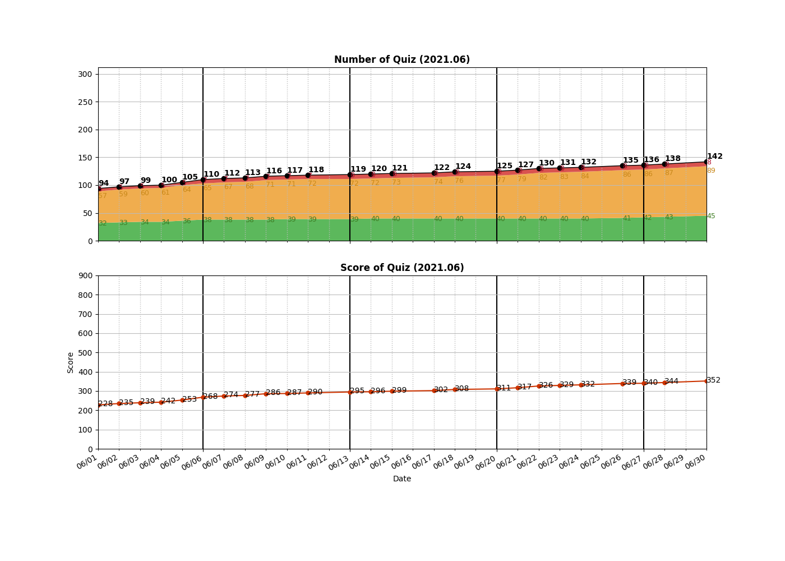
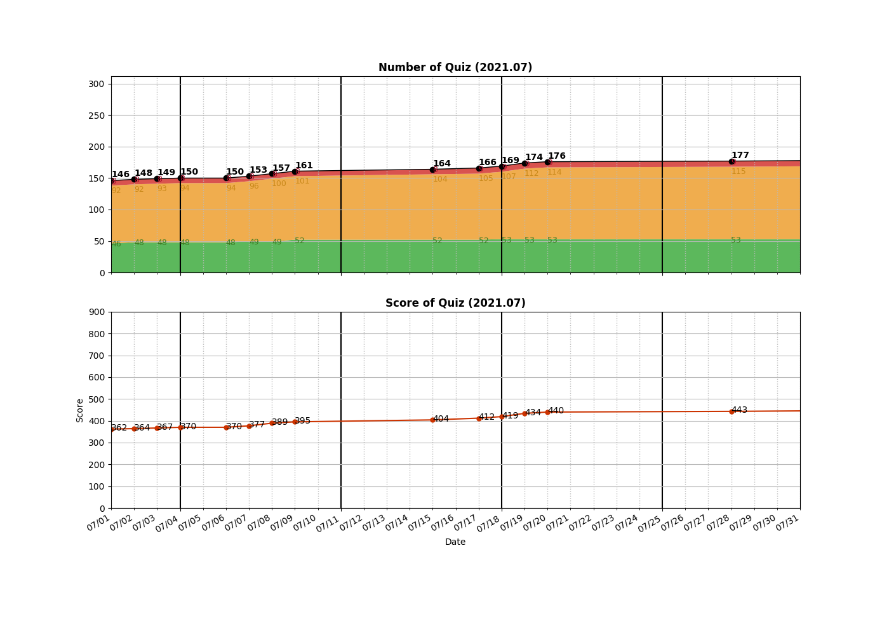

```
algo
├── Array
│   ├── __0053__Maximum\ Subarray.py
│   ├── __0122__Best\ Time\ to\ Buy\ and\ Sell\ Stock\ II.py
│   ├── __0239__Sliding\ Window\ Maximum.py
│   ├── __0350__Intersection\ of\ Two\ Arrays\ II.py
│   └── __0670__Maximum\ Swap.py
├── BFS
│   ├── __0102__Binary\ Tree\ Level\ Order\ Traversal.py
│   ├── __0103__Binary\ Tree\ Zigzag\ Level\ Order\ Traversal.py
│   ├── __0107__Binary\ Tree\ Level\ Order\ Traversal\ II.py
│   ├── __0111__Minimum\ Depth\ of\ Binary\ Tree.py
│   ├── __0127__Word\ Ladder.py
│   ├── __0133__Clone\ Graph.py
│   ├── __0199__Binary\ Tree\ Right\ Side\ View.py
│   ├── __0207__Course\ Schedule.py
│   ├── __0210__Course\ Schedule\ II.py
│   ├── __0297__Serialize\ and\ Deserialize\ Binary\ Tree.py
│   └── __0515__Find\ Largest\ Value\ in\ Each\ Tree\ Row.py
├── BinarySearch
│   ├── __0033__Search\ in\ Rotated\ Sorted\ Array.py
│   ├── __0034__Find\ First\ and\ Last\ Position\ of\ Element\ in\ Sorted\ Array.py
│   ├── __0050__Pow(x,\ n).py
│   ├── __0074__Search\ a\ 2D\ Matrix.py
│   ├── __0153__Find\ Minimum\ in\ Rotated\ Sorted\ Array.py
│   ├── __0162__Find\ Peak\ Element.py
│   ├── __0240__Search\ a\ 2D\ Matrix\ II.py
│   ├── __0278__First\ Bad\ Version.py
│   ├── __0658__Find\ K\ Closest\ Elements.py
│   └── __0704__Binary\ Search.py
├── BitOperation
│   └── __0136__Single\ Number.py
├── DFS
│   ├── _0212
│   ├── __0017__Letter\ Combinations\ of\ a\ Phone\ Number.py
│   ├── __0022__Generate\ Parentheses.py
│   ├── __0037__Sudoku\ Solver.py
│   ├── __0039__Combination\ Sum.py
│   ├── __0040__Combination\ Sum\ II.py
│   ├── __0046__Permutations.py
│   ├── __0047__Permutations\ II.py
│   ├── __0051__N-Queens.py
│   ├── __0052__N-Queens\ II.py
│   ├── __0077__Combinations.py
│   ├── __0078__Subsets.py
│   ├── __0079__Word\ Search.py
│   ├── __0089__Gray\ Code.py
│   ├── __0090__Subsets\ II.py
│   ├── __0112__Path\ Sum.py
│   ├── __0113__Path\ Sum\ II.py
│   ├── __0130__Surrounded\ Regions.py
│   ├── __0139__Word\ Break.py
│   ├── __0200__Number\ of\ Islands.py
│   ├── __0216__Combination\ Sum\ III.py
│   ├── __0401__Binary\ Watch.py
│   ├── __0560__Subarray\ Sum\ Equals\ K.py
│   ├── __0694__Number\ of\ Distinct\ Islands.py
│   ├── __0695__Max\ Area\ of\ Island.py
│   ├── __0784__Letter\ Case\ Permutation.py
│   ├── __1254__Number\ of\ Closed\ Islands.py
│   ├── __1391__Check\ if\ There\ is\ a\ Valid\ Path\ in\ a\ Grid.py
│   ├── __1593__Split\ a\ String\ Into\ the\ Max\ Number\ of\ Unique\ Substrings.py
│   └── __1905__Count\ Sub\ Islands.py
├── DP
│   ├── __0010__Regular\ Expression\ Matching.py
│   ├── __0044__Wildcard\ Matching.py
│   ├── __0062__Unique\ Paths.py
│   ├── __0064__Minimum\ Path\ Sum.py
│   ├── __0070__Climbing\ Stairs.py
│   ├── __0119__Pascal's\ Triangle\ II.py
│   ├── __0120__Triangle.py
│   ├── __0121__Best\ Time\ to\ Buy\ and\ Sell\ Stock.py
│   ├── __0221__Maximal\ Square.py
│   ├── __0322__Coin\ Change.py
│   └── __0576__Out\ of\ Boundary\ Paths.py
├── DataStructure
│   ├── __0146__LRU\ Cache.py
│   ├── __0387__First\ Unique\ Character\ in\ a\ String.py
│   ├── __0706__Design\ HashMap.py
│   └── __1429__First\ Unique\ Number.py
├── Graph
│   ├── __0323__Number\ of\ Connected\ Components\ in\ an\ Undirected\ Graph.py
│   ├── __0399__Evaluate\ Division.py
│   ├── __0547__Number\ of\ Provinces.py
│   ├── __0743__Network\ Delay\ Time.py
│   ├── __0787__Cheapest\ Flights\ Within\ K\ Stops.py
│   └── __0797__All\ Paths\ From\ Source\ to\ Target.py
├── HashMap
│   ├── __0001__Two\ Sum.py
│   ├── __0049__Group\ Anagrams.py
│   ├── __0287__Find\ the\ Duplicate\ Number.py
│   ├── __0290__Word\ Pattern.py
│   └── __0347__Top\ K\ Frequent\ Elements.py
├── Heap
│   ├── __0215__Kth\ Largest\ Element\ in\ an\ Array.py
│   ├── __0263__Ugly\ Number.py
│   ├── __0264__Ugly\ Number\ II.py
│   ├── __0378__Kth\ Smallest\ Element\ in\ a\ Sorted\ Matrix.py
│   ├── __0703__Kth\ Largest\ Element\ in\ a\ Stream.py
│   └── __0973__K\ Closest\ Points\ to\ Origin.py
├── LinkedList
│   ├── __0002__Add\ Two\ Numbers.py
│   ├── __0021__Merge\ Two\ Sorted\ Lists.py
│   ├── __0083__Remove\ Duplicates\ from\ Sorted\ List.py
│   ├── __0086__Partition\ List.py
│   ├── __0092__Reverse\ Linked\ List\ II.py
│   ├── __0141__Linked\ List\ Cycle.py
│   ├── __0142__Linked\ List\ Cycle\ II.py
│   ├── __0148__Sort\ List.py
│   ├── __0160__Intersection\ of\ Two\ Linked\ Lists.py
│   ├── __0206__Reverse\ Linked\ List.py
│   └── __0234__Palindrome\ Linked\ List.py
├── Sorting
│   └── __0242__Valid\ Anagram.py
├── Stack
│   ├── __0020__Valid\ Parentheses.py
│   └── __0155__Min\ Stack.py
├── String
│   ├── __0151__Reverse\ Words\ in\ a\ String.py
│   └── __0459__Repeated\ Substring\ Pattern.py
├── Tree
│   ├── __0094__Binary\ Tree\ Inorder\ Traversal.py\ 
│   ├── __0098__Validate\ Binary\ Search\ Tree.py
│   ├── __0100__Same\ Tree.py
│   ├── __0101__Symmetric\ Tree.py
│   ├── __0104__Maximum\ Depth\ of\ Binary\ Tree.py
│   ├── __0108__Convert\ Sorted\ Array\ to\ Binary\ Search\ Tree.py
│   ├── __0114__Flatten\ Binary\ Tree\ to\ Linked\ List.py
│   ├── __0144__Binary\ Tree\ Preorder\ Traversal.py
│   ├── __0173__Binary\ Search\ Tree\ Iterator.py
│   ├── __0208__Implement\ Trie\ (Prefix\ Tree).py
│   ├── __0226__Invert\ Binary\ Tree.py
│   ├── __0230__Kth\ Smallest\ Element\ in\ a\ BST.py
│   ├── __0235__Lowest\ Common\ Ancestor\ of\ a\ Binary\ Search\ Tree.py
│   ├── __0236__Lowest\ Common\ Ancestor\ of\ a\ Binary\ Tree.py
│   ├── __0257__Binary\ Tree\ Paths.py
│   ├── __0270__Closest\ Binary\ Search\ Tree\ Value.py
│   ├── __0366__Find\ Leaves\ of\ Binary\ Tree.py
│   ├── __0437__Path\ Sum\ III.py
│   ├── __0543__Diameter\ of\ Binary\ Tree.py
│   ├── __0559__Maximum\ Depth\ of\ N-ary\ Tree.py
│   ├── __0572__Subtree\ of\ Another\ Tree.py
│   ├── __0617__Merge\ Two\ Binary\ Trees.py
│   └── __0863__All\ Nodes\ Distance\ K\ in\ Binary\ Tree.py
├── Two-Pointer
│   ├── __0003__Longest\ Substring\ Without\ Repeating\ Characters.py
│   ├── __0005__Longest\ Palindromic\ Substring.py
│   ├── __0011__Container\ With\ Most\ Water.py
│   ├── __0015__3Sum.py
│   ├── __0016__3Sum\ Closest.py
│   ├── __0018__4Sum.py
│   ├── __0075__Sort\ Colors.py
│   ├── __0125__Valid\ Palindrome.py
│   ├── __0152__Maximum\ Product\ Subarray.py
│   ├── __0167__Two\ Sum\ II\ -\ Input\ array\ is\ sorted.py
│   ├── __0189__Rotate\ Array.py
│   ├── __0532__K-diff\ Pairs\ in\ an\ Array.py
│   ├── __0680__Valid\ Palindrome\ II.py
│   ├── __0905__Sort\ Array\ By\ Parity.py
│   ├── __0912__Sort\ an\ Array.py
│   ├── __0922__Sort\ Array\ By\ Parity\ II.py
│   ├── __0969__Pancake\ Sorting.py
│   └── __1099__Two\ Sum\ Less\ Than\ K.py
├── UnionFind
│   ├── __0128__Longest\ Consecutive\ Sequence.py
│   └── __0721__Accounts\ Merge.py
└── _Experiment
    ├── 20210616_currency_rate.py
    ├── ArrayList.py
    ├── LinkedList.py
    ├── UnrolledLinkedList.py
    ├── UnrolledLinkedList_Benchmark.py
    └── __pycache__
        ├── ArrayList.cpython-37.pyc
        ├── LinkedList.cpython-37.pyc
        └── UnrolledLinkedList.cpython-37.pyc

19 directories, 156 files

=====================================
============= Local Repo ============
=====================================
__0001__Two Sum.py
__0002__Add Two Numbers.py
__0003__Longest Substring Without Repeating Characters.py
__0005__Longest Palindromic Substring.py
__0010__Regular Expression Matching.py
__0011__Container With Most Water.py
__0015__3Sum.py
__0016__3Sum Closest.py
__0017__Letter Combinations of a Phone Number.py
__0018__4Sum.py
__0020__Valid Parentheses.py
__0021__Merge Two Sorted Lists.py
__0022__Generate Parentheses.py
__0033__Search in Rotated Sorted Array.py
__0034__Find First and Last Position of Element in Sorted Array.py
__0037__Sudoku Solver.py
__0039__Combination Sum.py
__0040__Combination Sum II.py
__0044__Wildcard Matching.py
__0046__Permutations.py
__0047__Permutations II.py
__0049__Group Anagrams.py
__0050__Pow(x, n).py
__0051__N-Queens.py
__0052__N-Queens II.py
__0053__Maximum Subarray.py
__0062__Unique Paths.py
__0064__Minimum Path Sum.py
__0070__Climbing Stairs.py
__0074__Search a 2D Matrix.py
__0075__Sort Colors.py
__0077__Combinations.py
__0078__Subsets.py
__0079__Word Search.py
__0083__Remove Duplicates from Sorted List.py
__0086__Partition List.py
__0089__Gray Code.py
__0090__Subsets II.py
__0092__Reverse Linked List II.py
__0094__Binary Tree Inorder Traversal.py 
__0098__Validate Binary Search Tree.py
__0100__Same Tree.py
__0101__Symmetric Tree.py
__0102__Binary Tree Level Order Traversal.py
__0103__Binary Tree Zigzag Level Order Traversal.py
__0104__Maximum Depth of Binary Tree.py
__0107__Binary Tree Level Order Traversal II.py
__0108__Convert Sorted Array to Binary Search Tree.py
__0111__Minimum Depth of Binary Tree.py
__0112__Path Sum.py
__0113__Path Sum II.py
__0114__Flatten Binary Tree to Linked List.py
__0119__Pascal's Triangle II.py
__0120__Triangle.py
__0121__Best Time to Buy and Sell Stock.py
__0122__Best Time to Buy and Sell Stock II.py
__0125__Valid Palindrome.py
__0127__Word Ladder.py
__0128__Longest Consecutive Sequence.py
__0130__Surrounded Regions.py
__0133__Clone Graph.py
__0136__Single Number.py
__0139__Word Break.py
__0141__Linked List Cycle.py
__0142__Linked List Cycle II.py
__0144__Binary Tree Preorder Traversal.py
__0146__LRU Cache.py
__0148__Sort List.py
__0151__Reverse Words in a String.py
__0152__Maximum Product Subarray.py
__0153__Find Minimum in Rotated Sorted Array.py
__0155__Min Stack.py
__0160__Intersection of Two Linked Lists.py
__0162__Find Peak Element.py
__0167__Two Sum II - Input array is sorted.py
__0173__Binary Search Tree Iterator.py
__0189__Rotate Array.py
__0199__Binary Tree Right Side View.py
__0200__Number of Islands.py
__0206__Reverse Linked List.py
__0207__Course Schedule.py
__0208__Implement Trie (Prefix Tree).py
__0210__Course Schedule II.py
__0215__Kth Largest Element in an Array.py
__0216__Combination Sum III.py
__0221__Maximal Square.py
__0226__Invert Binary Tree.py
__0230__Kth Smallest Element in a BST.py
__0234__Palindrome Linked List.py
__0235__Lowest Common Ancestor of a Binary Search Tree.py
__0236__Lowest Common Ancestor of a Binary Tree.py
__0239__Sliding Window Maximum.py
__0240__Search a 2D Matrix II.py
__0242__Valid Anagram.py
__0257__Binary Tree Paths.py
__0263__Ugly Number.py
__0264__Ugly Number II.py
__0270__Closest Binary Search Tree Value.py
__0278__First Bad Version.py
__0287__Find the Duplicate Number.py
__0290__Word Pattern.py
__0297__Serialize and Deserialize Binary Tree.py
__0322__Coin Change.py
__0323__Number of Connected Components in an Undirected Graph.py
__0347__Top K Frequent Elements.py
__0350__Intersection of Two Arrays II.py
__0366__Find Leaves of Binary Tree.py
__0378__Kth Smallest Element in a Sorted Matrix.py
__0387__First Unique Character in a String.py
__0399__Evaluate Division.py
__0401__Binary Watch.py
__0437__Path Sum III.py
__0459__Repeated Substring Pattern.py
__0515__Find Largest Value in Each Tree Row.py
__0532__K-diff Pairs in an Array.py
__0543__Diameter of Binary Tree.py
__0547__Number of Provinces.py
__0559__Maximum Depth of N-ary Tree.py
__0560__Subarray Sum Equals K.py
__0572__Subtree of Another Tree.py
__0576__Out of Boundary Paths.py
__0617__Merge Two Binary Trees.py
__0658__Find K Closest Elements.py
__0670__Maximum Swap.py
__0680__Valid Palindrome II.py
__0694__Number of Distinct Islands.py
__0695__Max Area of Island.py
__0703__Kth Largest Element in a Stream.py
__0704__Binary Search.py
__0706__Design HashMap.py
__0721__Accounts Merge.py
__0743__Network Delay Time.py
__0784__Letter Case Permutation.py
__0787__Cheapest Flights Within K Stops.py
__0797__All Paths From Source to Target.py
__0863__All Nodes Distance K in Binary Tree.py
__0905__Sort Array By Parity.py
__0912__Sort an Array.py
__0922__Sort Array By Parity II.py
__0969__Pancake Sorting.py
__0973__K Closest Points to Origin.py
__1099__Two Sum Less Than K.py
__1254__Number of Closed Islands.py
__1391__Check if There is a Valid Path in a Grid.py
__1429__First Unique Number.py
__1593__Split a String Into the Max Number of Unique Substrings.py
__1905__Count Sub Islands.py
=====================================
Num of Python Practice:  147


=====================================
============= Leetcode ==============
=====================================
 0001 Two Sum
 0002 Add Two Numbers
 0003 Longest Substring Without Repeating Characters
 0005 Longest Palindromic Substring
 0010 Regular Expression Matching
 0011 Container With Most Water
 0015 3Sum
 0016 3Sum Closest
 0017 Letter Combinations of a Phone Number
 0018 4Sum
 0020 Valid Parentheses
 0021 Merge Two Sorted Lists
 0022 Generate Parentheses
 0033 Search in Rotated Sorted Array
 0034 Find First and Last Position of Element in Sorted Array
 0036 Valid Sudoku
 0037 Sudoku Solver
 0039 Combination Sum
 0040 Combination Sum II
 0044 Wildcard Matching
 0046 Permutations
 0047 Permutations II
 0049 Group Anagrams
 0050 Pow(x, n)
 0051 N-Queens
 0052 N-Queens II
 0053 Maximum Subarray
 0062 Unique Paths
 0063 Unique Paths II
 0064 Minimum Path Sum
 0070 Climbing Stairs
 0074 Search a 2D Matrix
 0075 Sort Colors
 0077 Combinations
 0078 Subsets
 0079 Word Search
 0083 Remove Duplicates from Sorted List
 0086 Partition List
 0089 Gray Code
 0090 Subsets II
 0092 Reverse Linked List II
 0094 Binary Tree Inorder Traversal
 0098 Validate Binary Search Tree
 0100 Same Tree
 0101 Symmetric Tree
 0102 Binary Tree Level Order Traversal
 0103 Binary Tree Zigzag Level Order Traversal
 0104 Maximum Depth of Binary Tree
 0107 Binary Tree Level Order Traversal II
 0108 Convert Sorted Array to Binary Search Tree
 0111 Minimum Depth of Binary Tree
 0112 Path Sum
 0113 Path Sum II
 0114 Flatten Binary Tree to Linked List
 0119 Pascal's Triangle II
 0120 Triangle
 0121 Best Time to Buy and Sell Stock
 0122 Best Time to Buy and Sell Stock II
 0125 Valid Palindrome
 0127 Word Ladder
 0128 Longest Consecutive Sequence
 0130 Surrounded Regions
 0133 Clone Graph
 0136 Single Number
 0139 Word Break
 0141 Linked List Cycle
 0142 Linked List Cycle II
 0144 Binary Tree Preorder Traversal
 0146 LRU Cache
 0148 Sort List
 0151 Reverse Words in a String
 0152 Maximum Product Subarray
 0153 Find Minimum in Rotated Sorted Array
 0155 Min Stack
 0160 Intersection of Two Linked Lists
 0162 Find Peak Element
 0167 Two Sum II - Input array is sorted
 0173 Binary Search Tree Iterator
 0189 Rotate Array
 0199 Binary Tree Right Side View
 0200 Number of Islands
 0206 Reverse Linked List
 0207 Course Schedule
 0208 Implement Trie (Prefix Tree)
 0210 Course Schedule II
 0215 Kth Largest Element in an Array
 0216 Combination Sum III
 0221 Maximal Square
 0226 Invert Binary Tree
 0230 Kth Smallest Element in a BST
 0234 Palindrome Linked List
 0235 Lowest Common Ancestor of a Binary Search Tree
 0236 Lowest Common Ancestor of a Binary Tree
 0239 Sliding Window Maximum
 0240 Search a 2D Matrix II
 0242 Valid Anagram
 0257 Binary Tree Paths
 0263 Ugly Number
 0264 Ugly Number II
 0270 Closest Binary Search Tree Value
 0278 First Bad Version
 0287 Find the Duplicate Number
 0290 Word Pattern
 0297 Serialize and Deserialize Binary Tree
 0322 Coin Change
 0323 Number of Connected Components in an Undirected Graph
 0347 Top K Frequent Elements
 0350 Intersection of Two Arrays II
 0366 Find Leaves of Binary Tree
 0378 Kth Smallest Element in a Sorted Matrix
 0387 First Unique Character in a String
 0399 Evaluate Division
 0401 Binary Watch
 0437 Path Sum III
 0459 Repeated Substring Pattern
 0515 Find Largest Value in Each Tree Row
 0532 K-diff Pairs in an Array
 0543 Diameter of Binary Tree
 0547 Number of Provinces
 0559 Maximum Depth of N-ary Tree
 0560 Subarray Sum Equals K
 0572 Subtree of Another Tree
 0576 Out of Boundary Paths
 0617 Merge Two Binary Trees
 0658 Find K Closest Elements
 0670 Maximum Swap
 0680 Valid Palindrome II
 0694 Number of Distinct Islands
 0695 Max Area of Island
 0703 Kth Largest Element in a Stream
 0704 Binary Search
 0706 Design HashMap
 0721 Accounts Merge
 0743 Network Delay Time
 0784 Letter Case Permutation
 0787 Cheapest Flights Within K Stops
 0797 All Paths From Source to Target
 0863 All Nodes Distance K in Binary Tree
 0905 Sort Array By Parity
 0912 Sort an Array
 0922 Sort Array By Parity II
 0969 Pancake Sorting
 0973 K Closest Points to Origin
 0994 Rotting Oranges
 1099 Two Sum Less Than K
 1254 Number of Closed Islands
 1391 Check if There is a Valid Path in a Grid
 1429 First Unique Number
 1593 Split a String Into the Max Number of Unique Substrings
 1905 Count Sub Islands
=====================================
Solved / Total (Easy)  :   48 /  503
Solved / Total (Medium):   94 / 1015
Solved / Total (Hard)  :    8 /  405
Solved / Total (All)   :  150 / 1923
Total Score            :  370
=====================================

```




