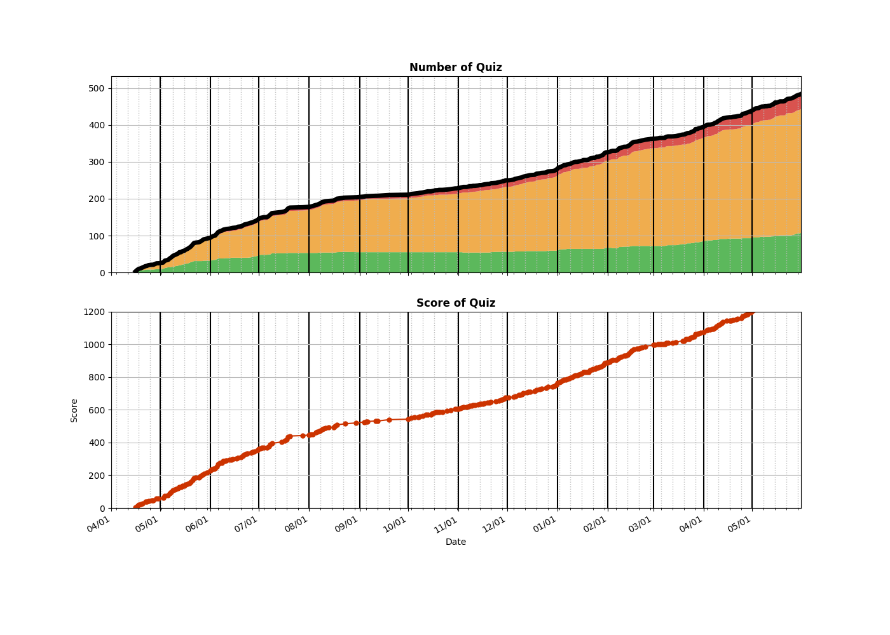

## 1. List of Practices
```
algo
├── Array
│   ├── __0036__Valid Sudoku.py
│   ├── __0053__Maximum Subarray.py
│   ├── __0056__Merge Intervals.py
│   ├── __0057__Insert Interval.py
│   ├── __0122__Best Time to Buy and Sell Stock II.py
│   ├── __0134__Gas Station.py
│   ├── __0228__Summary Ranges.py
│   ├── __0238__Product of Array Except Self.py
│   ├── __0243__Shortest Word Distance.py
│   ├── __0252__Meeting Rooms.py
│   ├── __0253__Meeting Rooms II.py
│   ├── __0283__Move Zeroes.py
│   ├── __0303__Range Sum Query - Immutable.py
│   ├── __0350__Intersection of Two Arrays II.py
│   ├── __0384__Shuffle an Array.py
│   ├── __0435__Non-overlapping Intervals.py
│   ├── __0523__Continuous Subarray Sum.py
│   ├── __0560__Subarray Sum Equals K.py
│   ├── __0670__Maximum Swap.py
│   ├── __0724__Find Pivot Index.py
│   ├── __0760__Find Anagram Mappings.py
│   ├── __0896__Monotonic Array.py
│   ├── __0954__Array of Doubled Pairs.py
│   ├── __0985__Sum of Even Numbers After Queries.py
│   ├── __0986__Interval List Intersections.py
│   └── __2154__Keep Multiplying Found Values by Two.py
├── BFS
│   ├── __0102__Binary Tree Level Order Traversal.py
│   ├── __0103__Binary Tree Zigzag Level Order Traversal.py
│   ├── __0107__Binary Tree Level Order Traversal II.py
│   ├── __0126__Word Ladder II.py
│   ├── __0127__Word Ladder.py
│   ├── __0133__Clone Graph.py
│   ├── __0199__Binary Tree Right Side View.py
│   ├── __0207__Course Schedule.py
│   ├── __0210__Course Schedule II.py
│   ├── __0286__Walls and Gates.py
│   ├── __0297__Serialize and Deserialize Binary Tree.py
│   ├── __0310__Minimum Height Trees.py
│   ├── __0515__Find Largest Value in Each Tree Row.py
│   ├── __0662__Maximum Width of Binary Tree.py
│   ├── __0752__Open the Lock.py
│   ├── __0909__Snakes and Ladders.py
│   ├── __0994__Rotting Oranges.py
│   ├── __1091__Shortest Path in Binary Matrix.py
│   ├── __1197__Minimum Knight Moves.py
│   └── __1306__Jump Game III.py
├── BinarySearch
│   ├── __0004__Median of Two Sorted Arrays.py
│   ├── __0033__Search in Rotated Sorted Array.py
│   ├── __0034__Find First and Last Position of Element in Sorted Array.py
│   ├── __0035__Search Insert Position.py
│   ├── __0050__Pow(x, n).py
│   ├── __0069__Sqrt(x).py
│   ├── __0074__Search a 2D Matrix.py
│   ├── __0081__Search in Rotated Sorted Array II.py
│   ├── __0153__Find Minimum in Rotated Sorted Array.py
│   ├── __0162__Find Peak Element.py
│   ├── __0240__Search a 2D Matrix II.py
│   ├── __0278__First Bad Version.py
│   ├── __0362__Design Hit Counter.py
│   ├── __0441__Arranging Coins.py
│   ├── __0528__Random Pick with Weight.py
│   ├── __0540__Single Element in a Sorted Array.py
│   ├── __0658__Find K Closest Elements.py
│   ├── __0702__Search in a Sorted Array of Unknown Size.py
│   ├── __0704__Binary Search.py
│   ├── __0875_Note
│   ├── __0875__Koko Eating Bananas.py
│   ├── __0981__Time Based Key-Value Store.py
│   ├── __1011__Capacity To Ship Packages Within D Days.py
│   ├── __1146__Snapshot Array.py
│   ├── __1182__Shortest Distance to Target Color.py
│   ├── __1198__Find Smallest Common Element in All Rows.py
│   ├── __1283__Find the Smallest Divisor Given a Threshold.py
│   └── __2226__Maximum Candies Allocated to K Children.py
├── BitOperation
│   └── __0136__Single Number.py
├── DFS
│   ├── __0017__Letter Combinations of a Phone Number.py
│   ├── __0022__Generate Parentheses.py
│   ├── __0037__Sudoku Solver.py
│   ├── __0039__Combination Sum.py
│   ├── __0040__Combination Sum II.py
│   ├── __0046__Permutations.py
│   ├── __0047__Permutations II.py
│   ├── __0051__N-Queens.py
│   ├── __0052__N-Queens II.py
│   ├── __0077__Combinations.py
│   ├── __0078__Subsets.py
│   ├── __0079__Word Search.py
│   ├── __0089__Gray Code.py
│   ├── __0090__Subsets II.py
│   ├── __0112__Path Sum.py
│   ├── __0113__Path Sum II.py
│   ├── __0131__Palindrome Partitioning.py
│   ├── __0139__Word Break.py
│   ├── __0212__Word Search II.py
│   ├── __0216__Combination Sum III.py
│   ├── __0291__Word Pattern II.py
│   ├── __0401__Binary Watch.py
│   ├── __0690__Employee Importance.py
│   ├── __0784__Letter Case Permutation.py
│   ├── __0841__Keys and Rooms.py
│   ├── __1391__Check if There is a Valid Path in a Grid.py
│   └── __1593__Split a String Into the Max Number of Unique Substrings.py
├── DP
│   ├── __0010__Regular Expression Matching.py
│   ├── __0044__Wildcard Matching.py
│   ├── __0045__Jump Game II.py
│   ├── __0055__Jump Game.py
│   ├── __0062__Unique Paths.py
│   ├── __0063__Unique Paths II.py
│   ├── __0064__Minimum Path Sum.py
│   ├── __0070__Climbing Stairs.py
│   ├── __0096__Unique Binary Search Trees.py
│   ├── __0118__Pascal's Triangle.py
│   ├── __0119__Pascal's Triangle II.py
│   ├── __0120__Triangle.py
│   ├── __0121__Best Time to Buy and Sell Stock.py
│   ├── __0123__Best Time to Buy and Sell Stock III.py
│   ├── __0152__Maximum Product Subarray.py
│   ├── __0198__House Robber.py
│   ├── __0221__Maximal Square.py
│   ├── __0256__Paint House.py
│   ├── __0279__Perfect Squares.py
│   ├── __0300__Longest Increasing Subsequence.py
│   ├── __0322__Coin Change.py
│   ├── __0338__Counting Bits.py
│   ├── __0377__Combination Sum IV.py
│   ├── __0416__Partition Equal Subset Sum.py
│   ├── __0474__Ones and Zeroes.py
│   ├── __0494__Target Sum.py
│   ├── __0509__Fibonacci Number.py
│   ├── __0516__Longest Palindromic Subsequence.py
│   ├── __0518__Coin Change 2.py
│   ├── __0542__01 Matrix.py
│   ├── __0576__Out of Boundary Paths.py
│   ├── __0646__Maximum Length of Pair Chain.py
│   ├── __0688__Knight Probability in Chessboard.py
│   ├── __0718__Maximum Length of Repeated Subarray.py
│   ├── __0740__Delete and Earn.py
│   ├── __0931__Minimum Falling Path Sum.py
│   ├── __0935__Knight Dialer.py
│   ├── __0983__Minimum Cost For Tickets.py
│   ├── __1014__Best Sightseeing Pair.py
│   ├── __1025__Divisor Game.py
│   ├── __1027__Longest Arithmetic Subsequence.py
│   ├── __1048__Longest String Chain.py
│   ├── __1049__Last Stone Weight II.py
│   ├── __1130__Minimum Cost Tree From Leaf Values.py
│   ├── __1137__N-th Tribonacci Number.py
│   ├── __1143__Longest Common Subsequence.py
│   ├── __1235__Maximum Profit in Job Scheduling.py
│   ├── __1277__Count Square Submatrices with All Ones.py
│   ├── __1289__Minimum Falling Path Sum II.py
│   ├── __1395__Count Number of Teams.py
│   ├── __1641__Count Sorted Vowel Strings.py
│   ├── __1696__Jump Game VI.py
│   ├── __1774__Closest Dessert Cost.py
│   ├── __1937__Maximum Number of Points with Cost.py
│   ├── __2008__Maximum Earnings From Taxi.py
│   └── __2218__Maximum Value of K Coins From Piles.py
├── DataStructure
│   ├── __0146__LRU Cache.py
│   ├── __0352__Data Stream as Disjoint Intervals.py
│   ├── __0380__Insert Delete GetRandom O(1).py
│   ├── __0387__First Unique Character in a String.py
│   ├── __0706__Design HashMap.py
│   └── __1429__First Unique Number.py
├── Graph
│   ├── __0261__Graph Valid Tree.py
│   ├── __0323__Number of Connected Components in an Undirected Graph.py
│   ├── __0332__Reconstruct Itinerary.py
│   ├── __0399__Evaluate Division.py
│   ├── __0490__The Maze.py
│   ├── __0499__The Maze III.py
│   ├── __0505__The Maze II.py
│   ├── __0547__Number of Provinces.py
│   ├── __0684__Redundant Connection.py
│   ├── __0743__Network Delay Time.py
│   ├── __0785__Is Graph Bipartite?.py
│   ├── __0787__Cheapest Flights Within K Stops.py
│   ├── __0797__All Paths From Source to Target.py
│   ├── __0947__Most Stones Removed with Same Row or Column.py
│   ├── __1319__Number of Operations to Make Network Connected.py
│   ├── __1557__Minimum Number of Vertices to Reach All Nodes.py
│   ├── __1971__Find if Path Exists in Graph.py
│   ├── __2093__Minimum Cost to Reach City With Discounts.py
│   └── __2225__Find Players With Zero or One Losses.py
├── Greedy
│   ├── __0316__Remove Duplicate Letters.py
│   ├── __1029__Two City Scheduling.py
│   ├── __1414__Find the Minimum Number of Fibonacci Numbers Whose Sum Is K.py
│   └── __2216__Minimum Deletions to Make Array Beautiful.py
├── HashMap
│   ├── __0001__Two Sum.py
│   ├── __0049__Group Anagrams.py
│   ├── __0137__Single Number II.py
│   ├── __0187__Repeated DNA Sequences.py
│   ├── __0244__Shortest Word Distance II.py
│   ├── __0249__Group Shifted Strings.py
│   ├── __0260__Single Number III.py
│   ├── __0287__Find the Duplicate Number.py
│   ├── __0290__Word Pattern.py
│   ├── __0349__Intersection of Two Arrays.py
│   ├── __0535__Encode and Decode TinyURL.py
│   ├── __0705__Design HashSet.py
│   ├── __1160__Find Words That Can Be Formed by Characters.py
│   ├── __1525__Number of Good Ways to Split a String.py
│   ├── __2007__Find Original Array From Doubled Array.py
│   ├── __2013__Detect Squares.py
│   ├── __2156__Find Substring With Given Hash Value.py
│   ├── __2215__Find the Difference of Two Arrays.py
│   └── __2227__Encrypt and Decrypt Strings.py
├── Heap
│   ├── __0215__Kth Largest Element in an Array.py
│   ├── __0263__Ugly Number.py
│   ├── __0264__Ugly Number II.py
│   ├── __0295__Find Median from Data Stream.py
│   ├── __0347__Top K Frequent Elements.py
│   ├── __0378__Kth Smallest Element in a Sorted Matrix.py
│   ├── __0480__Sliding Window Median.py
│   ├── __0692__Top K Frequent Words.py
│   ├── __0703__Kth Largest Element in a Stream.py
│   ├── __0973__K Closest Points to Origin.py
│   ├── __1094__Car Pooling.py
│   └── __1167__Minimum Cost to Connect Sticks.py
├── Island
│   ├── __0130__Surrounded Regions.py
│   ├── __0200__Number of Islands.py
│   ├── __0305__Number of Islands II.py
│   ├── __0417__Pacific Atlantic Water Flow.py
│   ├── __0694__Number of Distinct Islands.py
│   ├── __0695__Max Area of Island.py
│   ├── __0934__Shortest Bridge.py
│   ├── __1020__Number of Enclaves.py
│   ├── __1254__Number of Closed Islands.py
│   └── __1905__Count Sub Islands.py
├── LinkedList
│   ├── __0002__Add Two Numbers.py
│   ├── __0019__Remove Nth Node From End of List.py
│   ├── __0021__Merge Two Sorted Lists.py
│   ├── __0023__Merge k Sorted Lists.py
│   ├── __0024__Swap Nodes in Pairs.py
│   ├── __0061__Rotate List.py
│   ├── __0083__Remove Duplicates from Sorted List.py
│   ├── __0086__Partition List.py
│   ├── __0092__Reverse Linked List II.py
│   ├── __0138__Copy List with Random Pointer.py
│   ├── __0141__Linked List Cycle.py
│   ├── __0142__Linked List Cycle II.py
│   ├── __0148__Sort List.py
│   ├── __0160__Intersection of Two Linked Lists.py
│   ├── __0206__Reverse Linked List.py
│   ├── __0234__Palindrome Linked List.py
│   ├── __0237__Delete Node in a Linked List.py
│   └── __1721__Swapping Nodes in a Linked List.py
├── Math
│   ├── __0412__Fizz Buzz.py
│   ├── __0593__Valid Square.py
│   ├── __0754__Reach a Number.py
│   ├── __1344__Angle Between Hands of a Clock.py
│   ├── __2217__Find Palindrome With Fixed Length.py
│   └── __2224__Minimum Number of Operations to Convert Time.py
├── Matrix
│   ├── __0048__Rotate Image.py
│   ├── __0054__Spiral Matrix.py
│   ├── __0073__Set Matrix Zeroes.py
│   ├── __0304__Range Sum Query 2D - Immutable.py
│   ├── __0498__Diagonal Traverse.py
│   └── __1275__Find Winner on a Tic Tac Toe Game.py
├── Monotonic
│   ├── __0084__Largest Rectangle in Histogram.py
│   ├── __0085__Maximal Rectangle.py
│   ├── __0239__Sliding Window Maximum.py
│   ├── __0456__132 Pattern.py
│   ├── __0496__Next Greater Element I.py
│   ├── __0503__Next Greater Element II.py
│   ├── __0739__Daily Temperatures.py
│   ├── __0862__Shortest Subarray with Sum at Least K.py
│   ├── __0975__Odd Even Jump.py
│   ├── __1438__Longest Continuous Subarray With Absolute Diff Less Than or Equal to Limit.py
│   ├── __1475__Final Prices With a Special Discount in a Shop.py
│   └── __1762__Buildings With an Ocean View.py
├── Queue
│   └── __0346__Moving Average from Data Stream.py
├── Recursion
│   ├── __0095__Unique Binary Search Trees II.py
│   ├── __0241__Different Ways to Add Parentheses.py
│   ├── __0394__Decode String.py
│   ├── __0726__Number of Atoms.py
│   ├── __1087__Brace Expansion.py
│   └── __1096__Brace Expansion II.py
├── Sorting
│   ├── __0179__Largest Number.py
│   ├── __0242__Valid Anagram.py
│   └── __0539__Minimum Time Difference.py
├── Stack
│   ├── __0020__Valid Parentheses.py
│   ├── __0150__Evaluate Reverse Polish Notation.py
│   ├── __0155__Min Stack.py
│   └── __0735__Asteroid Collision.py
├── String
│   ├── __0009__Palindrome Number.py
│   ├── __0014__Longest Common Prefix.py
│   ├── __0151__Reverse Words in a String.py
│   ├── __0161__One Edit Distance.py
│   ├── __0168__Excel Sheet Column Title.py
│   ├── __0171__Excel Sheet Column Number.py
│   ├── __0392__Is Subsequence.py
│   ├── __0423__Reconstruct Original Digits from English.py
│   ├── __0459__Repeated Substring Pattern.py
│   ├── __0767__Reorganize String.py
│   ├── __0792__Number of Matching Subsequences.py
│   ├── __0811__Subdomain Visit Count.py
│   ├── __1041__Robot Bounded In Circle.py
│   └── __1165__Single-Row Keyboard.py
├── Tree
│   ├── __0094__Binary Tree Inorder Traversal.py
│   ├── __0098__Validate Binary Search Tree.py
│   ├── __0099__Recover Binary Search Tree.py
│   ├── __0100__Same Tree.py
│   ├── __0101__Symmetric Tree.py
│   ├── __0104__Maximum Depth of Binary Tree.py
│   ├── __0105__Construct Binary Tree from Preorder and Inorder Traversal.py
│   ├── __0108__Convert Sorted Array to Binary Search Tree.py
│   ├── __0109__Convert Sorted List to Binary Search Tree.py
│   ├── __0110__Balanced Binary Tree.py
│   ├── __0111__Minimum Depth of Binary Tree.py
│   ├── __0114__Flatten Binary Tree to Linked List.py
│   ├── __0116__Populating Next Right Pointers in Each Node.py
│   ├── __0129__Sum Root to Leaf Numbers.py
│   ├── __0144__Binary Tree Preorder Traversal.py
│   ├── __0173__Binary Search Tree Iterator.py
│   ├── __0222__Count Complete Tree Nodes.py
│   ├── __0226__Invert Binary Tree.py
│   ├── __0230__Kth Smallest Element in a BST.py
│   ├── __0235__Lowest Common Ancestor of a Binary Search Tree.py
│   ├── __0236__Lowest Common Ancestor of a Binary Tree.py
│   ├── __0257__Binary Tree Paths.py
│   ├── __0270__Closest Binary Search Tree Value.py
│   ├── __0285__Inorder Successor in BST.py
│   ├── __0314__Binary Tree Vertical Order Traversal.py
│   ├── __0333__Largest BST Subtree.py
│   ├── __0341__Flatten Nested List Iterator.py
│   ├── __0366__Find Leaves of Binary Tree.py
│   ├── __0437__Path Sum III.py
│   ├── __0449__Serialize and Deserialize BST.py
│   ├── __0450__Delete Node in a BST.py
│   ├── __0510__Inorder Successor in BST II.py
│   ├── __0513__Find Bottom Left Tree Value.py
│   ├── __0538__Convert BST to Greater Tree.py
│   ├── __0543__Diameter of Binary Tree.py
│   ├── __0559__Maximum Depth of N-ary Tree.py
│   ├── __0563__Binary Tree Tilt.py
│   ├── __0572__Subtree of Another Tree.py
│   ├── __0617__Merge Two Binary Trees.py
│   ├── __0687__Longest Univalue Path.py
│   ├── __0700__Search in a Binary Search Tree.py
│   ├── __0701__Insert into a Binary Search Tree.py
│   ├── __0776__Split BST.py
│   ├── __0863__All Nodes Distance K in Binary Tree.py
│   ├── __0938__Range Sum of BST.py
│   ├── __0958__Check Completeness of a Binary Tree.py
│   ├── __0979__Distribute Coins in Binary Tree.py
│   ├── __1008__Construct Binary Search Tree from Preorder Traversal.py
│   ├── __1038__Binary Search Tree to Greater Sum Tree.py
│   ├── __1110__Delete Nodes And Return Forest.py
│   ├── __1161__Maximum Level Sum of a Binary Tree.py
│   ├── __1302__Deepest Leaves Sum.py
│   ├── __1382__Balance a Binary Search Tree.py
│   ├── __1448__Count Good Nodes in Binary Tree.py
│   ├── __1530__Number of Good Leaf Nodes Pairs.py
│   ├── __1644__Lowest Common Ancestor of a Binary Tree II.py
│   └── __1650__Lowest Common Ancestor of a Binary Tree III.py
├── Trie
│   ├── __0208__Implement Trie (Prefix Tree).py
│   ├── __0211__Design Add and Search Words Data Structure.py
│   ├── __0648__Replace Words.py
│   ├── __0677__Map Sum Pairs.py
│   ├── __1166__Design File System.py
│   ├── __1268__Search Suggestions System.py
│   └── __1804__Implement Trie II (Prefix Tree).py
├── Two-Pointer
│   ├── __0003__Longest Substring Without Repeating Characters.py
│   ├── __0005__Longest Palindromic Substring.py
│   ├── __0011__Container With Most Water.py
│   ├── __0015__3Sum.py
│   ├── __0016__3Sum Closest.py
│   ├── __0018__4Sum.py
│   ├── __0031__Next Permutation.py
│   ├── __0042__Trapping Rain Water.py
│   ├── __0075__Sort Colors.py
│   ├── __0080__Remove Duplicates from Sorted Array II.py
│   ├── __0088__Merge Sorted Array.py
│   ├── __0125__Valid Palindrome.py
│   ├── __0159__Longest Substring with At Most Two Distinct Characters.py
│   ├── __0167__Two Sum II - Input array is sorted.py
│   ├── __0189__Rotate Array.py
│   ├── __0209__Minimum Size Subarray Sum.py
│   ├── __0259__3Sum Smaller.py
│   ├── __0277__Find the Celebrity.py
│   ├── __0340__Longest Substring with At Most K Distinct Characters.py
│   ├── __0395__Longest Substring with At Least K Repeating Characters.py
│   ├── __0438__Find All Anagrams in a String.py
│   ├── __0532__K-diff Pairs in an Array.py
│   ├── __0611__Valid Triangle Number.py
│   ├── __0643__Maximum Average Subarray I.py
│   ├── __0647__Palindromic Substrings.py
│   ├── __0680__Valid Palindrome II.py
│   ├── __0904__Fruit Into Baskets.py
│   ├── __0905__Sort Array By Parity.py
│   ├── __0912__Sort an Array.py
│   ├── __0922__Sort Array By Parity II.py
│   ├── __0930__Binary Subarrays With Sum.py
│   ├── __0969__Pancake Sorting.py
│   ├── __1099__Two Sum Less Than K.py
│   ├── __1214__Two Sum BSTs.py
│   ├── __1248__Count Number of Nice Subarrays.py
│   ├── __1358__Number of Substrings Containing All Three Characters.py
│   ├── __1711__Count Good Meals.py
│   └── __2155__All Divisions With the Highest Score of a Binary Array.py
├── UnionFind
│   ├── DisjointSet.py
│   ├── __0128__Longest Consecutive Sequence.py
│   └── __0721__Accounts Merge.py
├── _Experiment
│   ├── 20210616_currency_rate.py
│   ├── ArrayList.py
│   ├── LinkedList.py
│   ├── UnrolledLinkedList.py
│   ├── UnrolledLinkedList_Benchmark.py
│   └── __pycache__
│       ├── ArrayList.cpython-37.pyc
│       ├── LinkedList.cpython-37.pyc
│       └── UnrolledLinkedList.cpython-37.pyc
├── _Practice
│   ├── Mock
│   │   └── NumOfPathsToDest.py
│   ├── SN
│   │   ├── Countries.py
│   │   └── SwitchingArray.py
│   └── WP.py
│       └── BiggestNumber.py
└── _Template
    ├── BinarySearch.py
    └── BinarySearchRange.py

32 directories, 417 files

=====================================
============= Leetcode ==============
=====================================
 0001 Two Sum
 0002 Add Two Numbers
 0003 Longest Substring Without Repeating Characters
 0004 Median of Two Sorted Arrays
 0005 Longest Palindromic Substring
 0009 Palindrome Number
 0010 Regular Expression Matching
 0011 Container With Most Water
 0014 Longest Common Prefix
 0015 3Sum
 0016 3Sum Closest
 0017 Letter Combinations of a Phone Number
 0018 4Sum
 0019 Remove Nth Node From End of List
 0020 Valid Parentheses
 0021 Merge Two Sorted Lists
 0022 Generate Parentheses
 0023 Merge k Sorted Lists
 0024 Swap Nodes in Pairs
 0031 Next Permutation
 0033 Search in Rotated Sorted Array
 0034 Find First and Last Position of Element in Sorted Array
 0035 Search Insert Position
 0036 Valid Sudoku
 0037 Sudoku Solver
 0039 Combination Sum
 0040 Combination Sum II
 0042 Trapping Rain Water
 0044 Wildcard Matching
 0045 Jump Game II
 0046 Permutations
 0047 Permutations II
 0048 Rotate Image
 0049 Group Anagrams
 0050 Pow(x, n)
 0051 N-Queens
 0052 N-Queens II
 0053 Maximum Subarray
 0054 Spiral Matrix
 0055 Jump Game
 0056 Merge Intervals
 0057 Insert Interval
 0061 Rotate List
 0062 Unique Paths
 0063 Unique Paths II
 0064 Minimum Path Sum
 0069 Sqrt(x)
 0070 Climbing Stairs
 0073 Set Matrix Zeroes
 0074 Search a 2D Matrix
 0075 Sort Colors
 0077 Combinations
 0078 Subsets
 0079 Word Search
 0080 Remove Duplicates from Sorted Array II
 0081 Search in Rotated Sorted Array II
 0083 Remove Duplicates from Sorted List
 0084 Largest Rectangle in Histogram
 0085 Maximal Rectangle
 0086 Partition List
 0088 Merge Sorted Array
 0089 Gray Code
 0090 Subsets II
 0092 Reverse Linked List II
 0094 Binary Tree Inorder Traversal
 0095 Unique Binary Search Trees II
 0096 Unique Binary Search Trees
 0098 Validate Binary Search Tree
 0099 Recover Binary Search Tree
 0100 Same Tree
 0101 Symmetric Tree
 0102 Binary Tree Level Order Traversal
 0103 Binary Tree Zigzag Level Order Traversal
 0104 Maximum Depth of Binary Tree
 0105 Construct Binary Tree from Preorder and Inorder Traversal
 0107 Binary Tree Level Order Traversal II
 0108 Convert Sorted Array to Binary Search Tree
 0109 Convert Sorted List to Binary Search Tree
 0110 Balanced Binary Tree
 0111 Minimum Depth of Binary Tree
 0112 Path Sum
 0113 Path Sum II
 0114 Flatten Binary Tree to Linked List
 0116 Populating Next Right Pointers in Each Node
 0118 Pascal's Triangle
 0119 Pascal's Triangle II
 0120 Triangle
 0121 Best Time to Buy and Sell Stock
 0122 Best Time to Buy and Sell Stock II
 0123 Best Time to Buy and Sell Stock III
 0125 Valid Palindrome
 0126 Word Ladder II
 0127 Word Ladder
 0128 Longest Consecutive Sequence
 0129 Sum Root to Leaf Numbers
 0130 Surrounded Regions
 0131 Palindrome Partitioning
 0133 Clone Graph
 0134 Gas Station
 0136 Single Number
 0137 Single Number II
 0138 Copy List with Random Pointer
 0139 Word Break
 0141 Linked List Cycle
 0142 Linked List Cycle II
 0144 Binary Tree Preorder Traversal
 0146 LRU Cache
 0148 Sort List
 0150 Evaluate Reverse Polish Notation
 0151 Reverse Words in a String
 0152 Maximum Product Subarray
 0153 Find Minimum in Rotated Sorted Array
 0155 Min Stack
 0159 Longest Substring with At Most Two Distinct Characters
 0160 Intersection of Two Linked Lists
 0161 One Edit Distance
 0162 Find Peak Element
 0167 Two Sum II - Input Array Is Sorted
 0168 Excel Sheet Column Title
 0171 Excel Sheet Column Number
 0173 Binary Search Tree Iterator
 0179 Largest Number
 0187 Repeated DNA Sequences
 0189 Rotate Array
 0198 House Robber
 0199 Binary Tree Right Side View
 0200 Number of Islands
 0206 Reverse Linked List
 0207 Course Schedule
 0208 Implement Trie (Prefix Tree)
 0209 Minimum Size Subarray Sum
 0210 Course Schedule II
 0211 Design Add and Search Words Data Structure
 0212 Word Search II
 0215 Kth Largest Element in an Array
 0216 Combination Sum III
 0221 Maximal Square
 0222 Count Complete Tree Nodes
 0226 Invert Binary Tree
 0228 Summary Ranges
 0230 Kth Smallest Element in a BST
 0234 Palindrome Linked List
 0235 Lowest Common Ancestor of a Binary Search Tree
 0236 Lowest Common Ancestor of a Binary Tree
 0237 Delete Node in a Linked List
 0238 Product of Array Except Self
 0239 Sliding Window Maximum
 0240 Search a 2D Matrix II
 0241 Different Ways to Add Parentheses
 0242 Valid Anagram
 0243 Shortest Word Distance
 0244 Shortest Word Distance II
 0249 Group Shifted Strings
 0252 Meeting Rooms
 0253 Meeting Rooms II
 0256 Paint House
 0257 Binary Tree Paths
 0259 3Sum Smaller
 0260 Single Number III
 0261 Graph Valid Tree
 0263 Ugly Number
 0264 Ugly Number II
 0270 Closest Binary Search Tree Value
 0277 Find the Celebrity
 0278 First Bad Version
 0279 Perfect Squares
 0283 Move Zeroes
 0285 Inorder Successor in BST
 0286 Walls and Gates
 0287 Find the Duplicate Number
 0290 Word Pattern
 0291 Word Pattern II
 0295 Find Median from Data Stream
 0297 Serialize and Deserialize Binary Tree
 0300 Longest Increasing Subsequence
 0303 Range Sum Query - Immutable
 0304 Range Sum Query 2D - Immutable
 0305 Number of Islands II
 0310 Minimum Height Trees
 0314 Binary Tree Vertical Order Traversal
 0316 Remove Duplicate Letters
 0322 Coin Change
 0323 Number of Connected Components in an Undirected Graph
 0332 Reconstruct Itinerary
 0333 Largest BST Subtree
 0338 Counting Bits
 0340 Longest Substring with At Most K Distinct Characters
 0341 Flatten Nested List Iterator
 0346 Moving Average from Data Stream
 0347 Top K Frequent Elements
 0349 Intersection of Two Arrays
 0350 Intersection of Two Arrays II
 0352 Data Stream as Disjoint Intervals
 0362 Design Hit Counter
 0366 Find Leaves of Binary Tree
 0377 Combination Sum IV
 0378 Kth Smallest Element in a Sorted Matrix
 0380 Insert Delete GetRandom O(1)
 0384 Shuffle an Array
 0387 First Unique Character in a String
 0392 Is Subsequence
 0394 Decode String
 0395 Longest Substring with At Least K Repeating Characters
 0399 Evaluate Division
 0401 Binary Watch
 0412 Fizz Buzz
 0416 Partition Equal Subset Sum
 0417 Pacific Atlantic Water Flow
 0423 Reconstruct Original Digits from English
 0435 Non-overlapping Intervals
 0437 Path Sum III
 0438 Find All Anagrams in a String
 0441 Arranging Coins
 0449 Serialize and Deserialize BST
 0450 Delete Node in a BST
 0456 132 Pattern
 0459 Repeated Substring Pattern
 0474 Ones and Zeroes
 0480 Sliding Window Median
 0490 The Maze
 0494 Target Sum
 0496 Next Greater Element I
 0498 Diagonal Traverse
 0499 The Maze III
 0503 Next Greater Element II
 0505 The Maze II
 0509 Fibonacci Number
 0510 Inorder Successor in BST II
 0513 Find Bottom Left Tree Value
 0515 Find Largest Value in Each Tree Row
 0516 Longest Palindromic Subsequence
 0518 Coin Change 2
 0523 Continuous Subarray Sum
 0528 Random Pick with Weight
 0532 K-diff Pairs in an Array
 0535 Encode and Decode TinyURL
 0538 Convert BST to Greater Tree
 0539 Minimum Time Difference
 0540 Single Element in a Sorted Array
 0542 01 Matrix
 0543 Diameter of Binary Tree
 0547 Number of Provinces
 0559 Maximum Depth of N-ary Tree
 0560 Subarray Sum Equals K
 0563 Binary Tree Tilt
 0572 Subtree of Another Tree
 0576 Out of Boundary Paths
 0593 Valid Square
 0611 Valid Triangle Number
 0617 Merge Two Binary Trees
 0643 Maximum Average Subarray I
 0646 Maximum Length of Pair Chain
 0647 Palindromic Substrings
 0648 Replace Words
 0658 Find K Closest Elements
 0662 Maximum Width of Binary Tree
 0670 Maximum Swap
 0677 Map Sum Pairs
 0680 Valid Palindrome II
 0684 Redundant Connection
 0687 Longest Univalue Path
 0688 Knight Probability in Chessboard
 0690 Employee Importance
 0692 Top K Frequent Words
 0694 Number of Distinct Islands
 0695 Max Area of Island
 0700 Search in a Binary Search Tree
 0701 Insert into a Binary Search Tree
 0702 Search in a Sorted Array of Unknown Size
 0703 Kth Largest Element in a Stream
 0704 Binary Search
 0705 Design HashSet
 0706 Design HashMap
 0718 Maximum Length of Repeated Subarray
 0721 Accounts Merge
 0724 Find Pivot Index
 0726 Number of Atoms
 0735 Asteroid Collision
 0739 Daily Temperatures
 0740 Delete and Earn
 0743 Network Delay Time
 0752 Open the Lock
 0754 Reach a Number
 0760 Find Anagram Mappings
 0767 Reorganize String
 0776 Split BST
 0784 Letter Case Permutation
 0785 Is Graph Bipartite?
 0787 Cheapest Flights Within K Stops
 0792 Number of Matching Subsequences
 0797 All Paths From Source to Target
 0811 Subdomain Visit Count
 0841 Keys and Rooms
 0862 Shortest Subarray with Sum at Least K
 0863 All Nodes Distance K in Binary Tree
 0875 Koko Eating Bananas
 0896 Monotonic Array
 0904 Fruit Into Baskets
 0905 Sort Array By Parity
 0909 Snakes and Ladders
 0912 Sort an Array
 0922 Sort Array By Parity II
 0930 Binary Subarrays With Sum
 0931 Minimum Falling Path Sum
 0934 Shortest Bridge
 0935 Knight Dialer
 0938 Range Sum of BST
 0947 Most Stones Removed with Same Row or Column
 0954 Array of Doubled Pairs
 0958 Check Completeness of a Binary Tree
 0969 Pancake Sorting
 0973 K Closest Points to Origin
 0975 Odd Even Jump
 0979 Distribute Coins in Binary Tree
 0981 Time Based Key-Value Store
 0983 Minimum Cost For Tickets
 0985 Sum of Even Numbers After Queries
 0986 Interval List Intersections
 0994 Rotting Oranges
 1008 Construct Binary Search Tree from Preorder Traversal
 1011 Capacity To Ship Packages Within D Days
 1014 Best Sightseeing Pair
 1020 Number of Enclaves
 1025 Divisor Game
 1027 Longest Arithmetic Subsequence
 1029 Two City Scheduling
 1038 Binary Search Tree to Greater Sum Tree
 1041 Robot Bounded In Circle
 1048 Longest String Chain
 1049 Last Stone Weight II
 1087 Brace Expansion
 1091 Shortest Path in Binary Matrix
 1094 Car Pooling
 1096 Brace Expansion II
 1099 Two Sum Less Than K
 1110 Delete Nodes And Return Forest
 1130 Minimum Cost Tree From Leaf Values
 1137 N-th Tribonacci Number
 1143 Longest Common Subsequence
 1146 Snapshot Array
 1160 Find Words That Can Be Formed by Characters
 1161 Maximum Level Sum of a Binary Tree
 1165 Single-Row Keyboard
 1166 Design File System
 1167 Minimum Cost to Connect Sticks
 1182 Shortest Distance to Target Color
 1197 Minimum Knight Moves
 1198 Find Smallest Common Element in All Rows
 1214 Two Sum BSTs
 1235 Maximum Profit in Job Scheduling
 1248 Count Number of Nice Subarrays
 1254 Number of Closed Islands
 1268 Search Suggestions System
 1275 Find Winner on a Tic Tac Toe Game
 1277 Count Square Submatrices with All Ones
 1283 Find the Smallest Divisor Given a Threshold
 1289 Minimum Falling Path Sum II
 1302 Deepest Leaves Sum
 1306 Jump Game III
 1319 Number of Operations to Make Network Connected
 1344 Angle Between Hands of a Clock
 1358 Number of Substrings Containing All Three Characters
 1382 Balance a Binary Search Tree
 1391 Check if There is a Valid Path in a Grid
 1395 Count Number of Teams
 1414 Find the Minimum Number of Fibonacci Numbers Whose Sum Is K
 1429 First Unique Number
 1438 Longest Continuous Subarray With Absolute Diff Less Than or Equal to Limit
 1448 Count Good Nodes in Binary Tree
 1475 Final Prices With a Special Discount in a Shop
 1525 Number of Good Ways to Split a String
 1530 Number of Good Leaf Nodes Pairs
 1557 Minimum Number of Vertices to Reach All Nodes
 1593 Split a String Into the Max Number of Unique Substrings
 1641 Count Sorted Vowel Strings
 1644 Lowest Common Ancestor of a Binary Tree II
 1650 Lowest Common Ancestor of a Binary Tree III
 1696 Jump Game VI
 1711 Count Good Meals
 1721 Swapping Nodes in a Linked List
 1762 Buildings With an Ocean View
 1774 Closest Dessert Cost
 1804 Implement Trie II (Prefix Tree)
 1905 Count Sub Islands
 1937 Maximum Number of Points with Cost
 1971 Find if Path Exists in Graph
 2007 Find Original Array From Doubled Array
 2008 Maximum Earnings From Taxi
 2013 Detect Squares
 2093 Minimum Cost to Reach City With Discounts
 2154 Keep Multiplying Found Values by Two
 2155 All Divisions With the Highest Score of a Binary Array
 2156 Find Substring With Given Hash Value
 2215 Find the Difference of Two Arrays
 2216 Minimum Deletions to Make Array Beautiful
 2217 Find Palindrome With Fixed Length
 2218 Maximum Value of K Coins From Piles
 2224 Minimum Number of Operations to Convert Time
 2225 Find Players With Zero or One Losses
 2226 Maximum Candies Allocated to K Children
 2227 Encrypt and Decrypt Strings
=====================================
Solved / Total (Easy)  :   87 /  558
Solved / Total (Medium):  283 / 1189
Solved / Total (Hard)  :   31 /  481
Solved / Total (All)   :  401 / 2228
Total Score            : 1091
=====================================

```
## 2. Progress of Practices 

## 3. Interactive React App for Showing Practices

