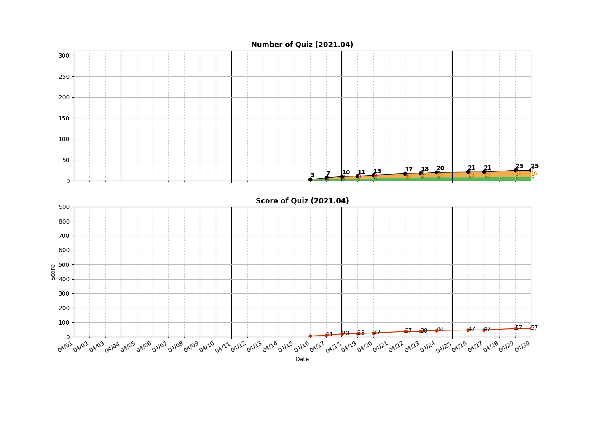

```
algo
├── BFS
├── BinarySearch
├── DFS
├── DP
├── DataStructure
├── HashMap
│   └── __0001__Two\ Sum.py
├── Heap
├── LinkedList
├── Sorting
├── String
├── Tree
└── Two-Pointer
    ├── __0003__Longest\ Substring\ Without\ Repeating\ Characters.py
    └── __0167__Two\ Sum\ II\ -\ Input\ array\ is\ sorted.py

12 directories, 3 files

=====================================
============= Local Repo ============
=====================================
__0001__Two Sum.py
__0003__Longest Substring Without Repeating Characters.py
__0167__Two Sum II - Input array is sorted.py
=====================================
Num of Python Practice:  3


=====================================
============= Leetcode ==============
=====================================
 0001 Two Sum
 0003 Longest Substring Without Repeating Characters
 0039 Combination Sum
 0046 Permutations
 0049 Group Anagrams
 0100 Same Tree
 0167 Two Sum II - Input array is sorted
 0200 Number of Islands
 0226 Invert Binary Tree
 0242 Valid Anagram
 0694 Number of Distinct Islands
=====================================
Solved / Total (Easy)  :    5 /  480
Solved / Total (Medium):    6 /  968
Solved / Total (Hard)  :    0 /  387
Solved / Total (All)   :   11 / 1835
Total Score            :   23
=====================================

```

